

<h1 align="center">CEISA Monitor</h1>

Pantau status dokumen pabean di portal CEISA 4.0 dalam satu layar. 
Dasbor, penugasan via WhatsApp, nilai dan pungutan per dokumen, presentasi rapat, laporan resmi, dan Excel.

<a href="#pemasangan"><b>Pemasangan (Chrome Web Store)</b></a> ·
<a href="docs/PANDUAN.md">Panduan bergambar</a> ·
<a href="docs/ALUR_KERJA.md">Alur kerja</a> ·
<a href="docs/FAQ.md">Tanya jawab</a> ·
<a href="SECURITY.md">Keamanan</a> ·
<a href="#english">English</a>

<b>Versi 1.17.0</b> · Chrome dan Edge · Bahasa Indonesia dan English · Gratis · Tidak resmi, tidak berafiliasi dengan DJBC

## Mengapa CEISA Monitor

Status dokumen, billing, dan NTPN ada di portal CEISA 4.0, tetapi tersebar di beberapa halaman. Untuk laporan, datanya disalin ke Excel dan disusun ulang, lalu tugas untuk tim diketik satu per satu ke WhatsApp. CEISA Monitor membaca data dengan sesi login Anda sendiri dan mengolahnya langsung di browser, tanpa server.

| Pekerjaan | Cara biasa | Dengan CEISA Monitor |
|---|---|---|
| Melihat status semua dokumen | Membuka Daftar Dokumen, menyaring jenis demi jenis | Satu dasbor: enam angka utama, komposisi status, dan dokumen yang melewati SLA |
| Mengetahui apa yang berubah | Membandingkan tampilan hari ini dengan ingatan atau catatan kemarin | Tanda BERUBAH beserta Riwayat Status dan Respon dari portal dengan jam persis |
| Memeriksa billing dan NTPN | Membuka Browse Billing, mencocokkan nomor dokumen secara manual | Kartu Tagihan: NTPN, tenggat, nilai, rincian pembayaran, dan PDF di dasbor |
| Menugaskan tim | Mengetik pesan WhatsApp per orang | Satu pesan siap kirim per penanggung jawab, berisi nomor, status, tugas, dan target |
| Menyusun laporan rapat | Menyalin data ke Excel dan PowerPoint | Presentasi, laporan resmi A4, Excel, dan ringkasan WhatsApp dari data yang sama |
| Membagikan contoh ke pihak luar | Menghapus identitas satu per satu | Pilihan Samarkan identitas pada semua keluaran |

### Yang membedakan

- **Dibuat dari alur kerja kepabeanan yang nyata.** Jenis dokumen, jalur, SLA, fasilitas, respons resmi CEISA 4.0, dan alur billing sampai NTPN dipahami langsung, bukan sekadar tabel umum.
- **Hanya membaca.** Ekstensi tidak mengisi, mengubah, atau mengirim apa pun ke portal, dan tidak menilai billing mana yang perlu dibayar.
- **Data tetap di komputer Anda.** Tanpa server, analitik, iklan, atau pihak ketiga; kata sandi dan token tidak disimpan.
- **Izin sekecil mungkin.** Akses host hanya ke `portal.beacukai.go.id`; daftar izin lengkap ada di [SECURITY.md](SECURITY.md).
- **Keluaran siap pakai.** Presentasi rapat, laporan resmi, Excel berformat, dan pesan WhatsApp keluar dari satu sumber data.
- **Dapat dicoba tanpa akun.** Mode demo memuat data contoh berlabel, jadi semua fitur bisa dilihat sebelum dipasang.
- **Jelas soal batasan.** Setiap fitur baru harus lolos empat gerbang produk: hanya membaca, tanpa izin baru, data tetap di perangkat, dan hanya menyajikan data. Perubahan per versi ada di [CHANGELOG](CHANGELOG.md).
- **Gratis dan tidak dikunci.** Dukungan bersifat sukarela.

**Untuk siapa:** staf dan supervisor ekspor-impor, PPJK yang menangani banyak klien, serta pengelola kawasan berikat dan KEK.

**Dibuat oleh** Trias Purwantoro, praktisi ekspor-impor dan Ahli Kepabeanan bersertifikat, sebagai proyek independen yang dipakai dan diperbaiki dari pekerjaan sehari-hari. Kritik dan usul fitur disampaikan lewat [Issues](../../issues/new/choose).

## Fitur

| Kebutuhan | Yang disediakan |
|---|---|
| Gambaran cepat | Enam angka utama untuk semua jenis dokumen, dibandingkan dengan 30 hari lalu, periode sebelumnya, atau tahun lalu |
| Semua data | Menarik seluruh dokumen yang tersedia di portal, termasuk tahun-tahun sebelumnya |
| Periode bebas | 7/30/90 hari, bulan ini, bulan lalu, kuartal, tahun ini, tahun lalu, semua data, atau rentang tanggal sendiri |
| Komposisi status | Donat dan daftar status dengan jumlah dan persentase; pilih jenis dokumen pada tombol di atas dasbor untuk melihatnya per jenis, dan klik status untuk menyaring rincian |
| Verifikasi ke kantor | Dokumen Pemeriksaan Dokumen dengan jalur bukan merah bertanda **VERIFIKASI** (bukan Jalur Merah), karena dokumen perlu disampaikan dan diverifikasi ke kantor Bea Cukai |
| Apa yang berubah | Perubahan sejak kemarin, sejak Senin, 7 hari terakhir, atau sejak terakhir dibuka |
| Kapan berubah | Popup ikon **BERUBAH** menampilkan **Riwayat Status dan Riwayat Respon dari portal** dengan jam persis, seperti tab di portal; status yang baru muncul ditandai. Riwayat diambil per dokumen saat popup dibuka, tanpa nama petugas. Kartu rincian memuat status sebelum dan sesudah, dengan kode respons resmi CEISA 4.0 diterjemahkan otomatis |
| Isi dokumen | Tombol **Ambil isi dokumen…** dengan dialog cakupan (rentang tanggal daftar dan jenis dokumen). Kartu arsip per pengajuan (klik dua kali baris): dokumen pelengkap, barang, nilai, pungutan, jaminan; pencarian nomor invoice, B/L, dan kontainer |
| Nilai dan pungutan | Total nilai pabean, pungutan dibayar dan berfasilitas, tabel rincian per dokumen (BM, PPN, PPh, total dibayar, fasilitas) yang dapat dicari dan diurutkan, serta rekap bulanan; BC 2.5 dan sejenisnya dibaca dari lembar PUNGUTAN portal; tombol Excel membuka dialog cakupan (periode dan jenis dokumen sendiri, ringkasan kelengkapan, lembar Cakupan, pilihan satu lembar per jenis) |
| Siapa yang menangani | Tindak lanjut per dokumen: penanggung jawab, tugas, target, catatan, dan riwayat perubahan |
| Penugasan | Satu pesan WhatsApp per penanggung jawab, berisi nomor pengajuan, nomor pendaftaran, status, tugas, dan target |
| Tagihan | Kartu dari Browse Billing: billing menurut NTPN, tenggat, dan nilai. Rincian per billing (riwayat status, bukti pembayaran, pungutan per akun) serta PDF billing dan PDF respon dengan pratinjau di dasbor. Hanya menyajikan data; rincian diambil saat diklik dan tidak disimpan |
| Samarkan identitas | Pilihan pada Excel, presentasi/laporan, dan ringkasan: nama perusahaan menjadi Perusahaan A, B, dan seterusnya, logo dihapus, nomor pengajuan, kode billing, NTPN, dan NPWP/NITKU hanya menampilkan empat angka terakhir |
| Prioritas harian | Kartu **Hari ini**: tugas terlambat atau jatuh tempo, Jalur Merah atau pemeriksaan yang belum selesai, baru melewati SLA, dan belum ada penanggung jawab |
| Laporan | Presentasi .pptx (26 slide, atau 9 slide pada mode ringkasan eksekutif) dengan slide Poin utama, bab Nilai dan pungutan, dan lampiran; laporan resmi A4 (PDF/Word) dengan bab dan lampiran yang sama; Excel dengan lembar Daftar Isi, Nilai per Dokumen, dan Perubahan Status; ringkasan WhatsApp Pagi/Sore dengan nilai dan tugas hari ini |
| Kenyamanan | Bahasa Indonesia sejak pembukaan pertama (English dari tombol ID/EN), tema terang dan gelap, mode demo |

## Lihat cara kerjanya

| Penugasan via WhatsApp | Komposisi status |
|---|---|
|  | 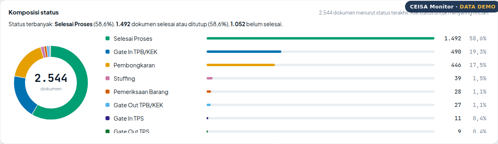 |
| **Rincian perubahan status** | **Riwayat dari portal pada ikon BERUBAH** |
|  | 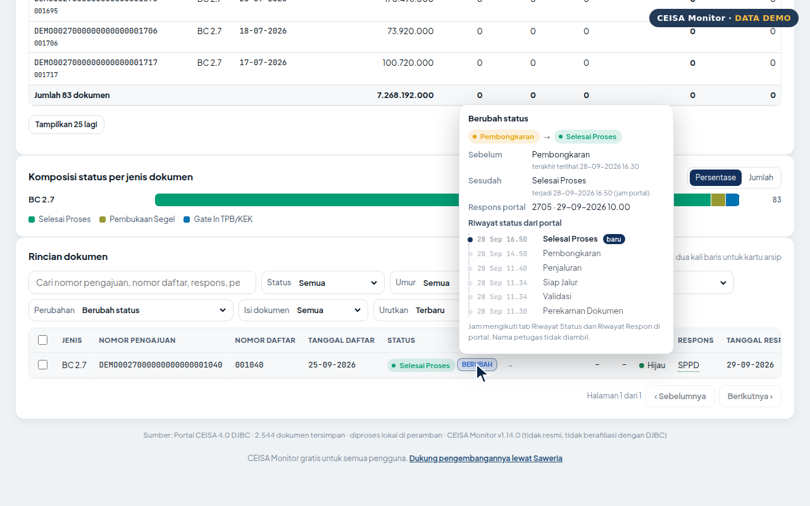 |
| **Tindak lanjut** | **Presentasi rapat** |
|  |  |
| **Ambil isi dokumen** | **Nilai dan pungutan per dokumen** |
| 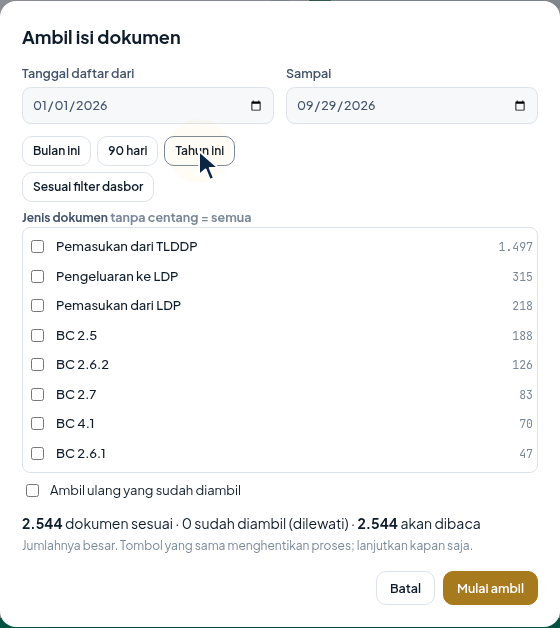 | 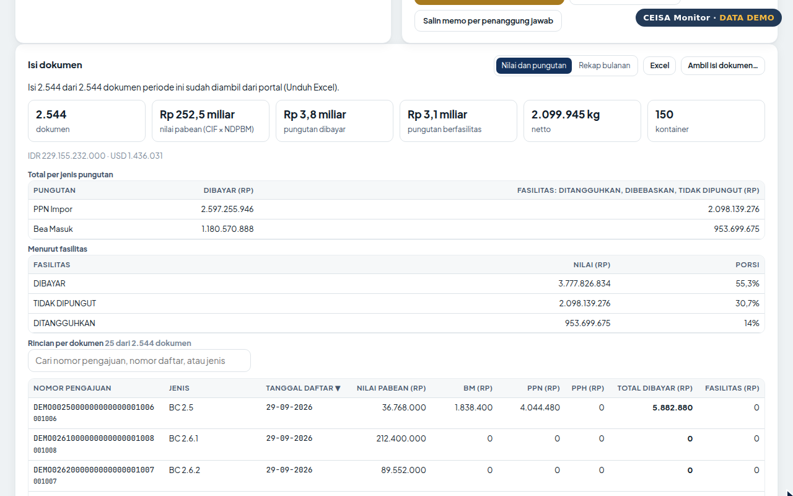 |
| **Per jenis dokumen dengan filter kartu** | **Rincian dikelompokkan per jenis** |
| 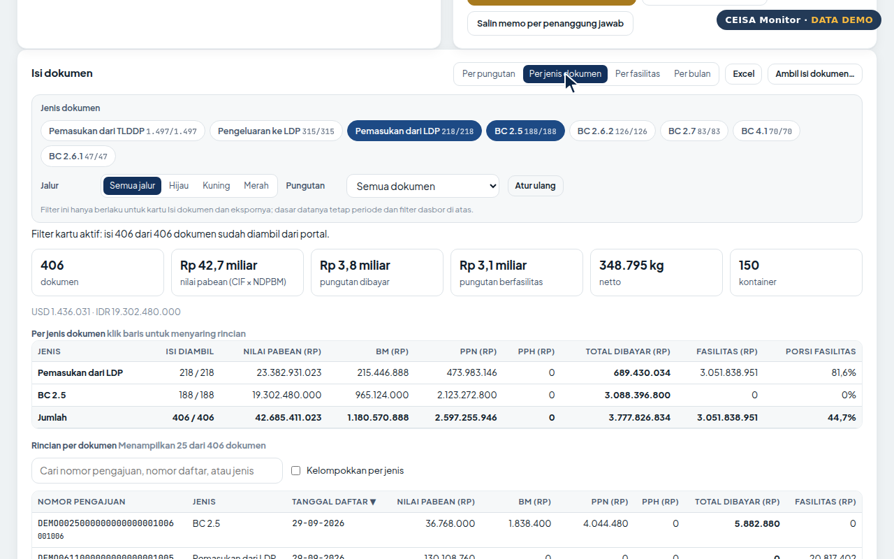 | 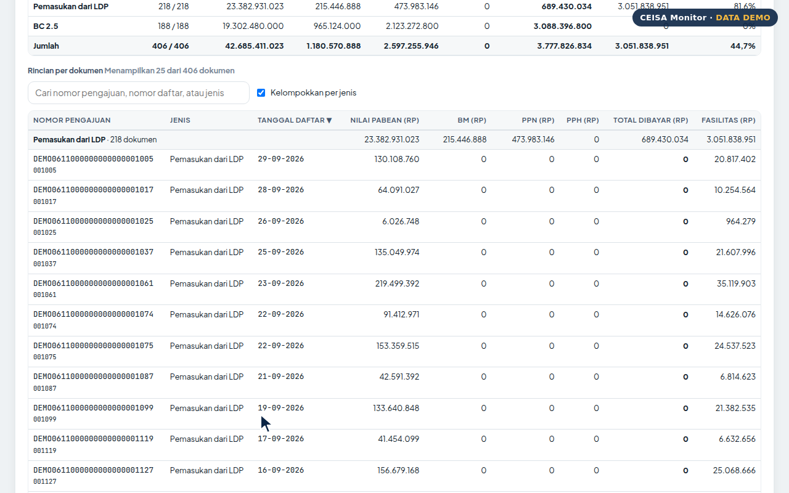 |
| **Kartu arsip pengajuan** | **Ringkasan WhatsApp/surel** |
|  | 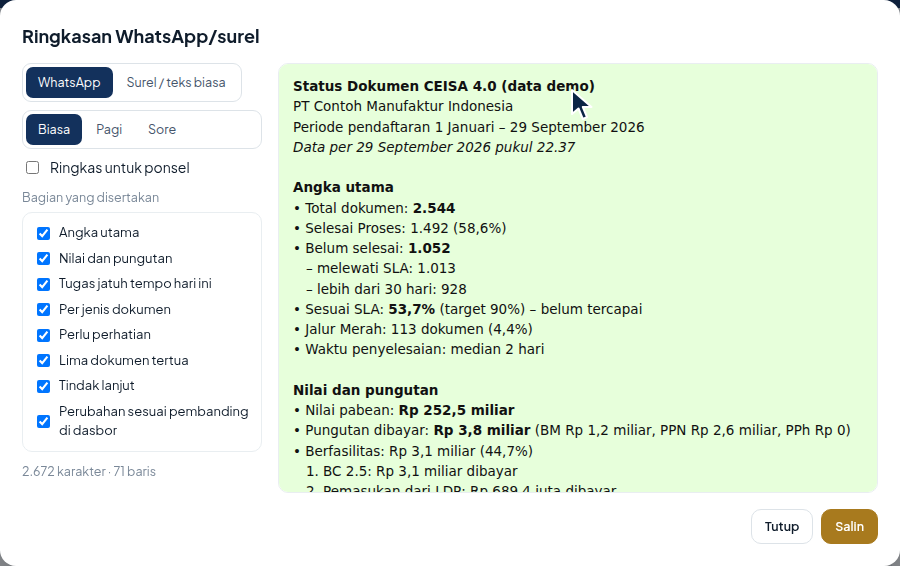 |
| **Hari ini** | **Rekap bulanan** |
| 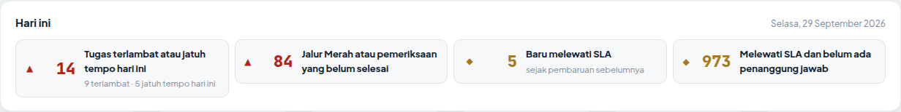 | 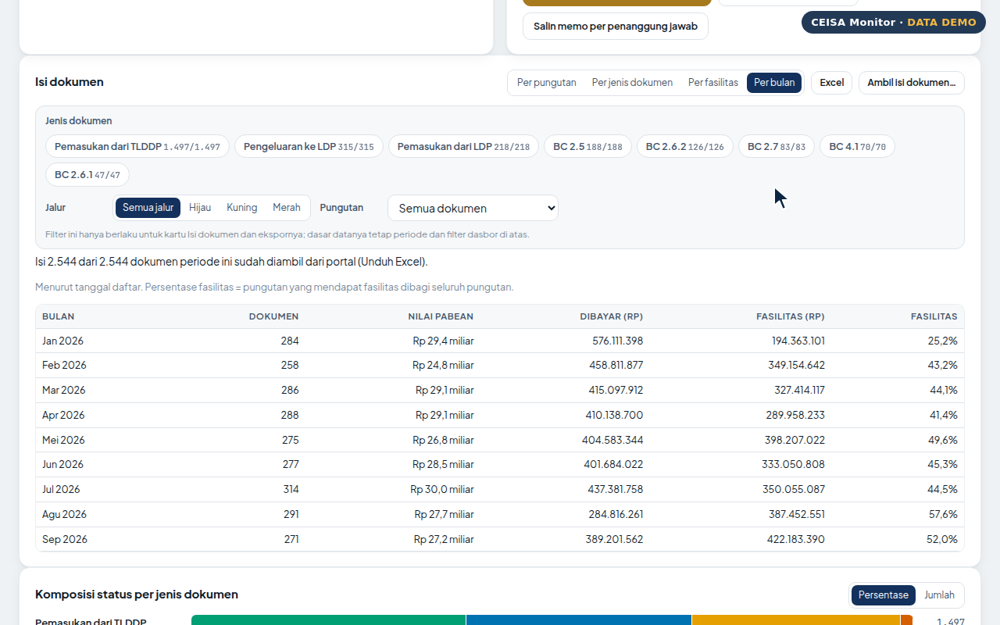 |
| **Kartu Tagihan** | **Rincian billing** |
| 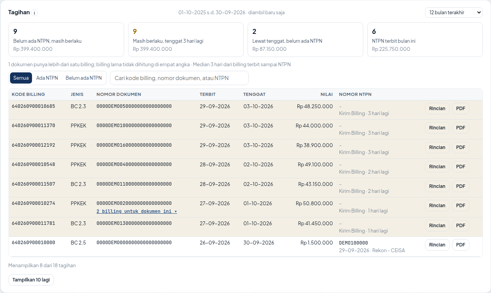 | 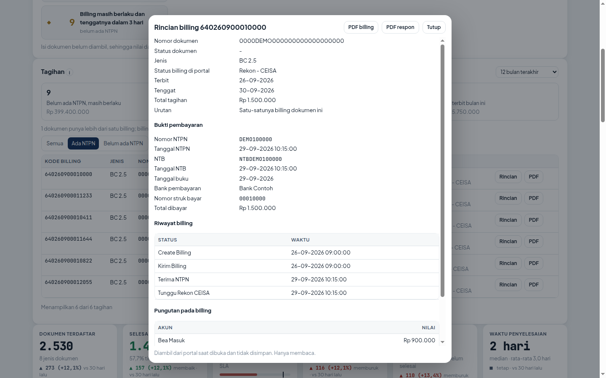 |
| **Pratinjau PDF billing** | **Samarkan identitas** |
| 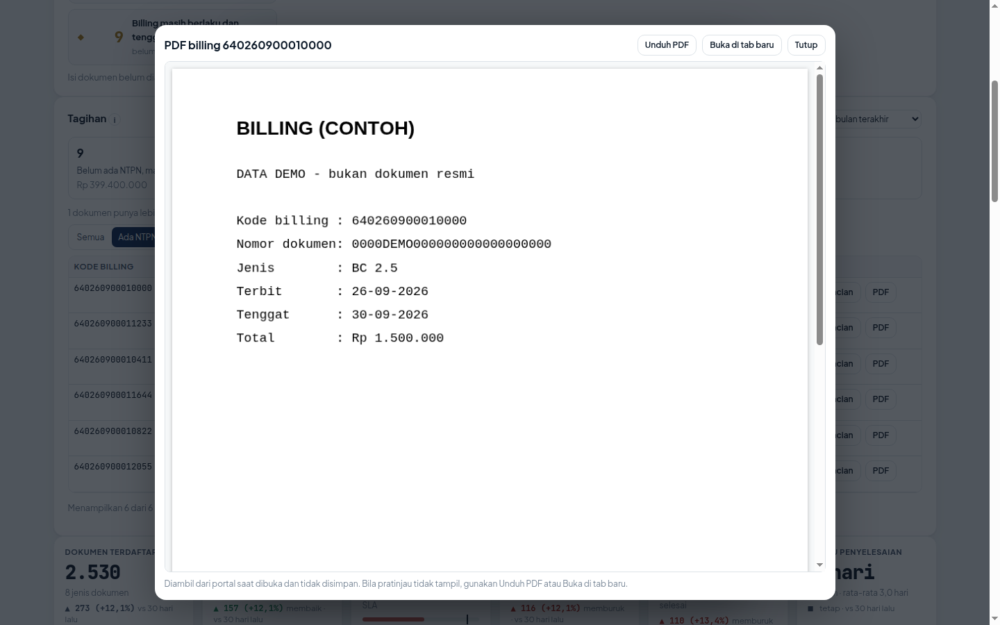 | 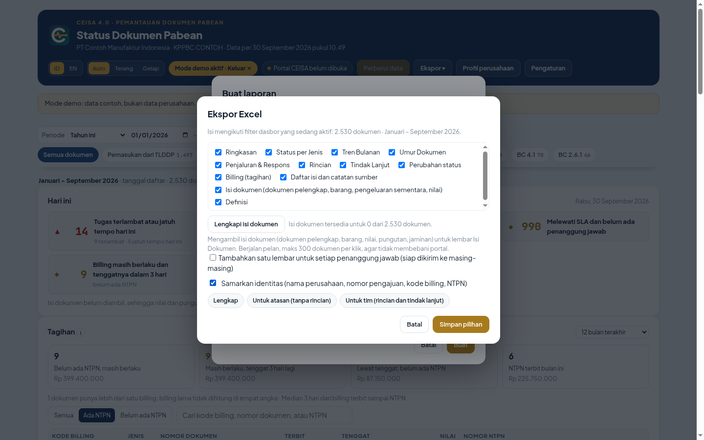 |

Video **Yang baru di v1.17** (bernarasi dan bersubtitle, sekitar 3 menit): kartu Tagihan dari Browse Billing, rincian dan PDF billing, lembar Billing di Excel, dan Samarkan identitas. Video lengkap v1.17.0 (sekitar 13 menit) membahas seluruh fitur. Keduanya, beserta subtitle SRT, ada di rilis [v1.17.0](../../releases/tag/v1.17.0). Video sebelumnya ada di rilis [v1.16.3](../../releases/tag/v1.16.3) dan [v1.12.0](../../releases/tag/v1.12.0). Perubahan lengkap ada di [CHANGELOG](CHANGELOG.md), rencana fitur di [ROADMAP](ROADMAP.md).

Video tutorial lengkap untuk dasar pemakaian (15 bagian, direkam pada versi 1.7) tersedia di rilis [v1.7.0](../../releases/tag/v1.7.0). Semua gambar dan video memakai data demo.

## Pemasangan

CEISA Monitor dipasang **hanya dari Chrome Web Store**. Repositori ini berisi dokumentasi, panduan, dan catatan proyek; berkas ekstensi tidak dibagikan di sini.

**Status:** sedang dalam tinjauan Chrome Web Store. Tautan pemasangan akan ditambahkan di sini setelah tayang.

Setelah tayang:

1. Buka tautan Chrome Web Store di atas dengan Chrome atau Edge, lalu klik **Tambahkan ke Chrome** (Edge: **Dapatkan**) dan konfirmasi.
2. Klik ikon puzzle di bilah alat, lalu sematkan CEISA Monitor.
3. Pembaruan berjalan otomatis lewat Chrome dan data Anda tetap tersimpan di browser.

Jangan memasang berkas ZIP atau folder ekstensi dari sumber lain, termasuk yang mengaku sebagai CEISA Monitor. Satu-satunya saluran resmi adalah tautan Chrome Web Store yang tercantum di halaman ini. Bila tautan berubah, halaman ini yang diperbarui lebih dulu.

## Mulai dalam empat langkah

1. **Masuk ke portal CEISA 4.0** seperti biasa dengan akun Anda sendiri.
2. **Buka halaman Daftar Dokumen** (`portal.beacukai.go.id/dokumen-pabean/`) dan tunggu sampai tabel tampil.
3. **Buka dasbor CEISA Monitor, lalu klik Perbarui data.** Penarikan pertama untuk semua data memerlukan beberapa menit. Biarkan tab portal tetap terbuka.
4. **Atur Profil perusahaan**: jenis fasilitas, status final, dan target SLA.

Ingin mencoba dahulu tanpa masuk ke portal? Pilih **Coba mode demo** pada layar sambutan. Langkah lengkap ada di [Panduan](docs/PANDUAN.md), dan contoh rutinitas harian, mingguan, dan bulanan ada di [Alur kerja](docs/ALUR_KERJA.md).

## Keamanan dan privasi

- Hanya membaca data dengan sesi login Anda sendiri. Kata sandi dan token tidak disimpan, dan sesi tidak diperpanjang.
- Data diolah dan disimpan di browser Anda. Tidak ada server, analitik, iklan, atau pihak ketiga.
- Izin minimum: penyimpanan lokal, akses ke `portal.beacukai.go.id` saja, dan alarm.
- Kebijakan keamanan konten (CSP) ketat: hanya skrip dari dalam paket yang boleh berjalan.
- Pesan WhatsApp hanya disalin atau dibuka bila Anda mengklik tombolnya; ekstensi tidak mengirim pesan sendiri.
- Dipasang dan diperbarui hanya lewat Chrome Web Store. Izin yang diminta tampil di halaman Store dan di `chrome://extensions`, dan dapat dicocokkan dengan daftar di [SECURITY.md](SECURITY.md).
- Rincian: [SECURITY.md](SECURITY.md) · [Kebijakan privasi](docs/privacy-policy.html) · [PRIVACY.md](PRIVACY.md)

## Masukan dan dukungan

Temukan masalah atau punya ide fitur? Buka [Issues](../../issues/new/choose) dan pilih templat yang sesuai. Jangan melampirkan data asli perusahaan, nomor pengajuan, atau tangkapan layar portal yang memuat data rahasia.

## Dukung proyek ini

Tombol **Bagikan ke rekan** di dasbor membuka pesan siap kirim ke LinkedIn, WhatsApp, X, atau Telegram; hanya tautan proyek yang dikirim.

CEISA Monitor gratis untuk semua pengguna dan seluruh fiturnya tidak dikunci. Bila bermanfaat bagi tim Anda, dukungan sukarela dapat diberikan melalui [Saweria](https://saweria.co/triasex) (rupiah, QRIS, dan e-wallet) atau [Buy Me a Coffee](https://buymeacoffee.com/triase) (kartu dan mata uang asing), atau dengan memindai salah satu kode QR di bawah. Dana dipakai untuk pengembangan, pengujian dengan data nyata, dan dokumentasi.

<table align="center">
<tr>
<td align="center"><a href="https://saweria.co/triasex">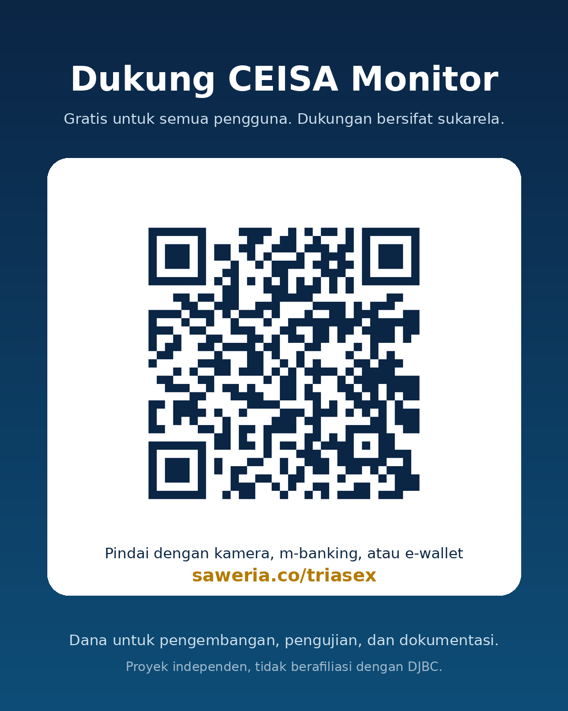</a> <b>Saweria</b> rupiah, QRIS, e-wallet</td>
<td align="center"> <b>Buy Me a Coffee</b> kartu dan mata uang asing</td>
</tr>
</table>

## Lisensi

Hak cipta © 2026 Trias Purwantoro. Hak cipta dilindungi. Repositori ini hanya berisi dokumentasi; kode ekstensi tidak dipublikasikan di sini. Ekstensi boleh dipasang dan dipakai untuk pekerjaan sendiri, tetapi tidak boleh disalin, diubah, diekstrak ulang, atau didistribusikan ulang tanpa izin tertulis. Lihat [LICENSE](LICENSE). Pustaka ExcelJS dan PptxGenJS memakai lisensi MIT masing-masing.

---

## English

CEISA Monitor is a free Chrome and Edge extension for Indonesia's CEISA 4.0 customs portal. It pulls all documents available to your account and turns them into a dashboard with any period and comparison and a status-composition donut. "Fetch document contents" opens a scope dialog (list date range and a document-type picker based on the official 243-type reference) and reads each submission's own Excel export into an archive card (supporting documents, goods, value, duties, guarantees) and a Value and duties tab with a per-document breakdown (customs value, import duty, VAT, income tax, total paid, facilities) and monthly recap. The BERUBAH popup shows a status-history timeline, and status-change details show before/after and portal responses. Also included: a Today card, follow-up tracking with WhatsApp task messages per owner, a 22-slide meeting deck, a formal A4 report, and an Excel workbook. It reads data with your own login session and processes everything locally in the browser: no server, no stored passwords, read-only. The interface opens in Indonesian; switch to English with the ID/EN button. Light or dark theme.

Install: only from the Chrome Web Store (under review; the link will be added here once it is live). This repository holds documentation only. Try demo mode first if you do not have a CEISA account.

Independent project, not affiliated with Indonesian Customs (DJBC). All rights reserved; see [LICENSE](LICENSE).
