
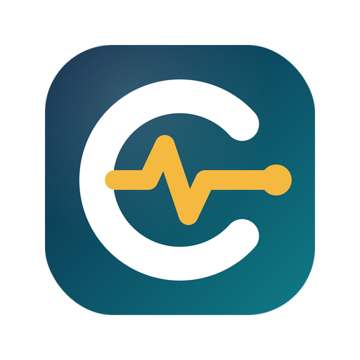

<h1 align="center">CEISA Monitor</h1>

Pantau status dokumen pabean di portal CEISA 4.0 dalam satu layar. 
Dasbor, penugasan via WhatsApp, ringkasan pagi, presentasi rapat, laporan resmi, dan Excel.

<a href="../../releases/latest"><b>Unduh rilis terbaru</b></a> ·
<a href="docs/PANDUAN.md">Panduan bergambar</a> ·
<a href="docs/ALUR_KERJA.md">Alur kerja</a> ·
<a href="docs/FAQ.md">Tanya jawab</a> ·
<a href="SECURITY.md">Keamanan</a> ·
<a href="#english">English</a>

<b>Versi 1.10.0</b> · Chrome dan Edge · Bahasa Indonesia dan English · Gratis · Tidak resmi, tidak berafiliasi dengan DJBC

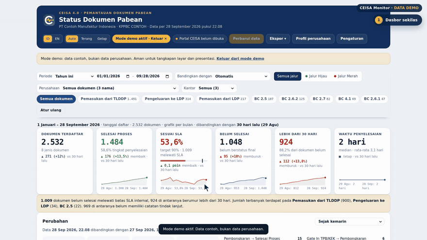

## Mengapa CEISA Monitor

Status dokumen ada di portal CEISA 4.0, tetapi harus dicari halaman demi halaman, disalin ke Excel, lalu disusun menjadi laporan. Tugas untuk tim pun diketik ulang satu per satu ke WhatsApp. CEISA Monitor membaca daftar dokumen dengan sesi login Anda sendiri dan mengolahnya langsung di peramban, tanpa server.

## Fitur

| Kebutuhan | Yang disediakan |
|---|---|
| Gambaran cepat | Enam angka utama untuk semua jenis dokumen, dibandingkan dengan 30 hari lalu, periode sebelumnya, atau tahun lalu |
| Semua data | Menarik seluruh dokumen yang tersedia di portal, termasuk tahun-tahun sebelumnya |
| Periode bebas | 7/30/90 hari, bulan ini, bulan lalu, kuartal, tahun ini, tahun lalu, semua data, atau rentang tanggal sendiri |
| Tren yang mudah dibaca | Grafik Aliran dokumen: masuk, selesai, dan posisi yang belum selesai |
| Apa yang berubah | Perubahan sejak kemarin, sejak Senin, 7 hari terakhir, atau sejak terakhir dibuka |
| Kapan berubah | Kartu rincian: status sebelum dan sesudah, riwayat status, jam pasti setiap status dan respons dari portal, dan kode respons resmi CEISA 4.0; kartu Waktu proses menampilkan waktu layanan portal dalam jam |
| Isi dokumen | Kartu arsip per pengajuan (klik dua kali baris): dokumen pelengkap, barang, nilai, pungutan, jaminan; pencarian nomor invoice, B/L, dan kontainer; pengeluaran sementara (mis. BC 2.6.1 dan 2.6.2) dicocokkan per seri barang; pemeriksaan otomatis |
| Siapa yang menangani | Tindak lanjut per dokumen: penanggung jawab, tugas, target, catatan, dan riwayat perubahan |
| Penugasan | Satu pesan WhatsApp per penanggung jawab, berisi nomor pengajuan, nomor pendaftaran, status, tugas, dan target |
| Pengingat | Ringkasan pagi, tugas jatuh tempo, dan peringatan prioritas untuk Jalur Merah, pemeriksaan, dan SPJM |
| Laporan | Presentasi .pptx 22 slide, laporan resmi A4 (PDF/Word), Excel 8 lembar, ringkasan WhatsApp |
| Tim | Templat tugas sendiri, ekspor/impor catatan tindak lanjut antarkomputer tanpa server |
| Kenyamanan | Bahasa Indonesia dan English, tema terang dan gelap, mode demo |

## Lihat cara kerjanya

| Penugasan via WhatsApp | Ringkasan pagi dan prioritas |
|---|---|
| 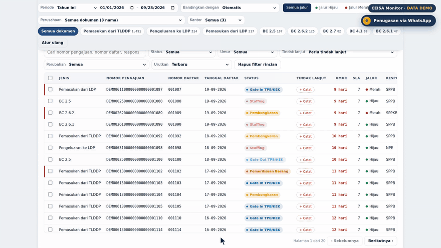 | 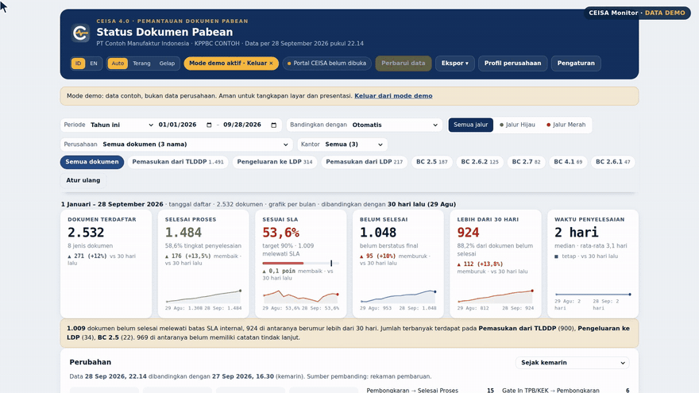 |
| **Rincian perubahan status** | **Aliran dokumen** |
| 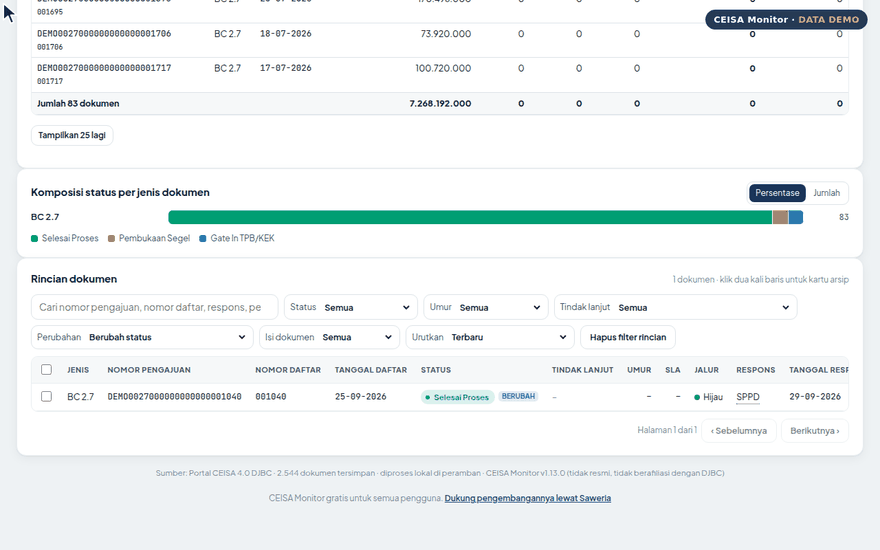 | 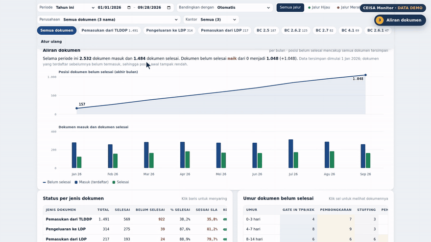 |
| **Tindak lanjut** | **Presentasi rapat** |
| 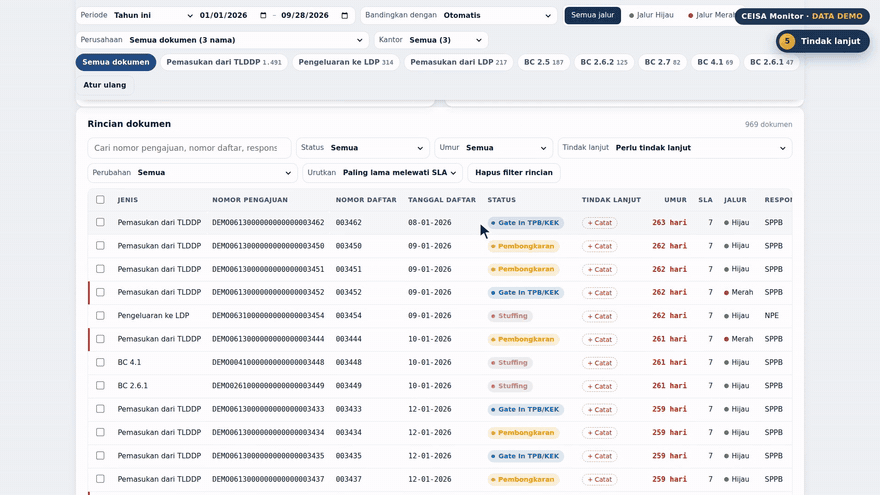 | 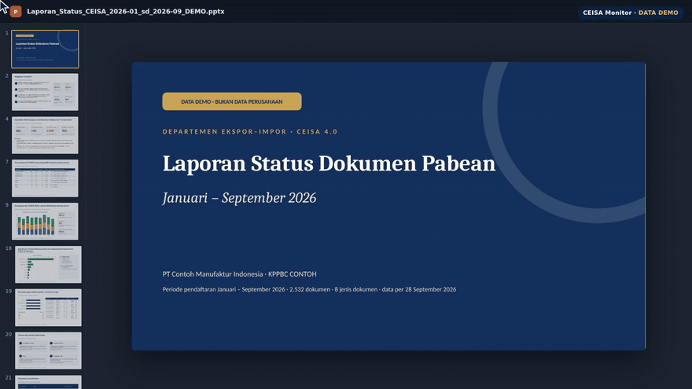 |
| **Kartu arsip pengajuan** | **Isi dokumen: pengeluaran sementara** |
| 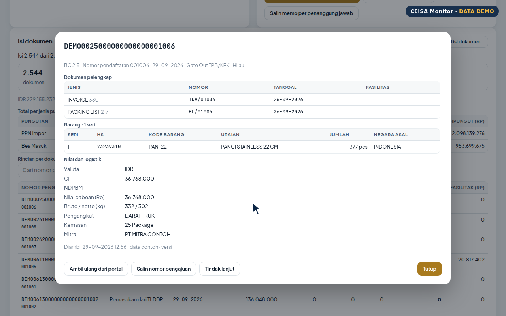 | 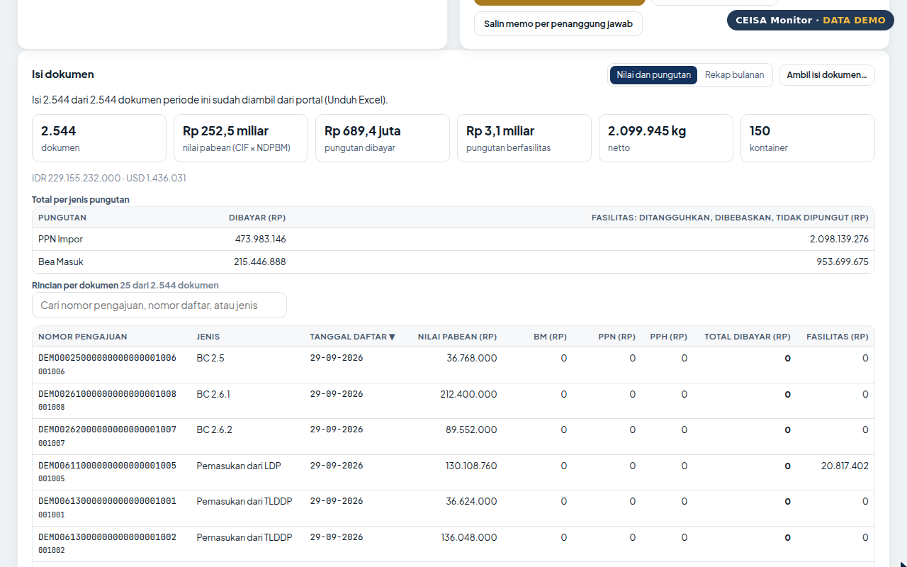 |
| **Waktu proses** | **Pemeriksaan otomatis** |
| 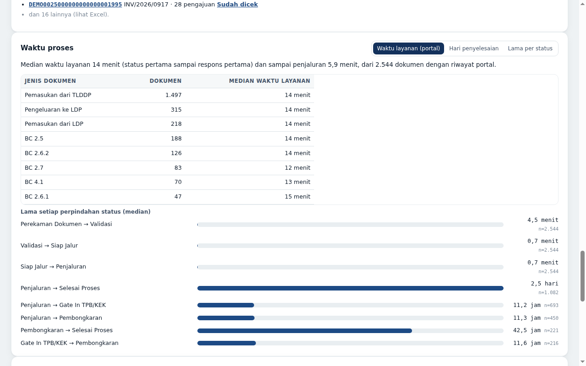 | 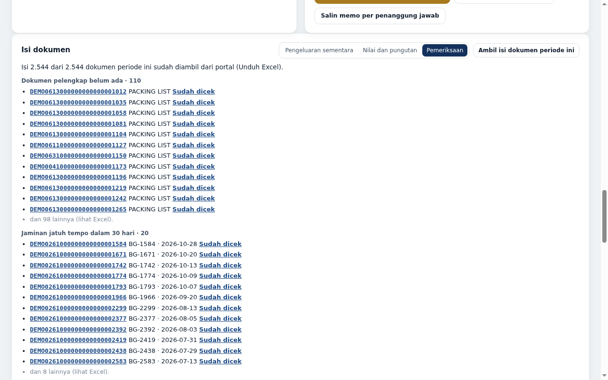 |

Video **Yang baru di v1.10** (3 menit, bernarasi dan bersubtitle): riwayat portal dan kode respons, isi dokumen dan pengeluaran sementara, kartu arsip, serta waktu proses dan laporan. Unduh `CEISA_Monitor_Yang_Baru_v1.10.mp4` dari rilis [v1.10.0](../../releases/tag/v1.10.0).

Video tutorial lengkap untuk dasar pemakaian (15 bagian, direkam pada versi 1.7) tersedia di rilis [v1.7.0](../../releases/tag/v1.7.0). Semua gambar dan video memakai data demo.

## Pemasangan

1. Unduh `ceisa-monitor-v1.10.0.zip` dari [Releases](../../releases/latest), lalu ekstrak. Anda juga dapat memakai folder [`extension/`](extension) di repositori ini.
2. Buka `chrome://extensions` (atau `edge://extensions`), lalu aktifkan **Developer mode**.
3. Klik **Load unpacked** dan pilih folder hasil ekstrak.
4. Sematkan ikon CEISA Monitor di bilah alat.

Untuk memastikan paket tidak diubah pihak lain, cocokkan kode SHA-256 di [SECURITY.md](SECURITY.md#memeriksa-keaslian-paket). Versi Chrome Web Store sedang disiapkan; tautannya akan ditambahkan di sini setelah tayang.

## Mulai dalam empat langkah

1. **Masuk ke portal CEISA 4.0** seperti biasa dengan akun Anda sendiri.
2. **Buka halaman Daftar Dokumen** (`portal.beacukai.go.id/dokumen-pabean/`) dan tunggu sampai tabel tampil.
3. **Buka dasbor CEISA Monitor, lalu klik Perbarui data.** Penarikan pertama untuk semua data memerlukan beberapa menit. Biarkan tab portal tetap terbuka.
4. **Atur Profil perusahaan**: jenis fasilitas, status final, dan target SLA.

Ingin mencoba dahulu tanpa masuk ke portal? Pilih **Coba mode demo** pada layar sambutan. Langkah lengkap ada di [Panduan](docs/PANDUAN.md), dan contoh rutinitas harian, mingguan, dan bulanan ada di [Alur kerja](docs/ALUR_KERJA.md).

## Keamanan dan privasi

- Hanya membaca data dengan sesi login Anda sendiri. Kata sandi dan token tidak disimpan, dan sesi tidak diperpanjang.
- Data diolah dan disimpan di peramban Anda. Tidak ada server, analitik, iklan, atau pihak ketiga.
- Izin minimum: penyimpanan lokal, akses ke `portal.beacukai.go.id` saja, alarm, dan notifikasi.
- Kebijakan keamanan konten (CSP) ketat: hanya skrip dari dalam paket yang boleh berjalan.
- Pesan WhatsApp hanya disalin atau dibuka bila Anda mengklik tombolnya; ekstensi tidak mengirim pesan sendiri.
- Setiap perubahan pada folder `extension/` diperiksa otomatis oleh GitHub Actions (SHA-256, manifest, CSP, dan larangan kode dari luar).
- Rincian: [SECURITY.md](SECURITY.md) · [Kebijakan privasi](docs/privacy-policy.html) · [PRIVACY.md](PRIVACY.md)

## Masukan dan dukungan

Temukan masalah atau punya ide fitur? Buka [Issues](../../issues/new/choose) dan pilih templat yang sesuai. Jangan melampirkan data asli perusahaan, nomor pengajuan, atau tangkapan layar portal yang memuat data rahasia.

CEISA Monitor gratis untuk semua pengguna. Bila bermanfaat bagi tim Anda, dukungan sukarela dapat diberikan melalui [saweria.co/triastore](https://saweria.co/triastore).

## Lisensi

Hak cipta © 2026 Trias Purwantoro. Hak cipta dilindungi. Folder `extension/` berisi paket rilis yang sudah diminifikasi; kode sumber tidak dipublikasikan. Ekstensi boleh dipasang dan dipakai untuk pekerjaan sendiri, tetapi tidak boleh disalin, diubah, diekstrak ulang, atau didistribusikan ulang tanpa izin tertulis. Lihat [LICENSE](LICENSE). Pustaka ExcelJS dan PptxGenJS memakai lisensi MIT masing-masing.

---

## English

CEISA Monitor is a free Chrome and Edge extension for Indonesia's CEISA 4.0 customs portal. It pulls all documents available to your account and turns them into a dashboard with any period and comparison, a document-flow chart, an archive card per submission read from the portal's own Excel export (supporting documents, goods, value, duties, guarantees) with temporary-export matching and automatic checks, status-change details (before/after, when it changed, portal response time, status history), follow-up tracking with WhatsApp task messages per owner, a morning summary with due-task reminders, priority alerts for red-channel and inspection documents, a 22-slide meeting deck, a formal A4 report, and an 8-sheet Excel workbook. It reads data with your own login session and processes everything locally in the browser: no server, no stored passwords, read-only. Interface in Indonesian or English, light or dark theme.

Install: download the zip from [Releases](../../releases/latest), unzip, open `chrome://extensions`, enable Developer mode, and choose Load unpacked. Try demo mode first if you do not have a CEISA account.

Independent project, not affiliated with Indonesian Customs (DJBC). All rights reserved; see [LICENSE](LICENSE).
