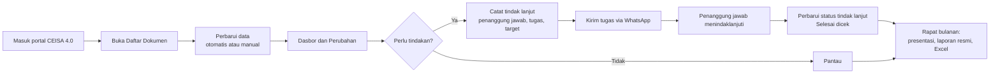

# Alur Kerja dengan CEISA Monitor

Contoh rutinitas tim ekspor-impor: harian, mingguan, dan bulanan. Sesuaikan dengan prosedur perusahaan Anda.

[Kembali ke README](../README.md) · [Panduan lengkap](PANDUAN.md)

## Gambaran besar

Data hanya mengalir dari portal ke peramban Anda. Ekstensi tidak mengubah apa pun di portal dan tidak mengirim data ke server.

## Harian (10–15 menit)

| Waktu | Langkah | Fitur |
|---|---|---|
| 08.00 | Buka dasbor, lihat kartu **Hari ini** | Hari ini |
| 08.05 | Lihat kartu **Perubahan** "Sejak kemarin"; klik **Ekspor → Bagikan ringkasan** untuk ditempel ke grup WhatsApp tim | Perubahan |
| 08.10 | Periksa dokumen **Prioritas** (Jalur Merah, pemeriksaan, SPJM) | Perubahan → Prioritas |
| 08.15 | Klik **Tampilkan yang perlu ditindaklanjuti**, isi penanggung jawab, tugas, dan target | Tindak lanjut |
| 08.20 | **Kirim tugas via WhatsApp** dengan cakupan "Jatuh tempo" atau "Belum pernah dikirim" | Penugasan |
| Sepanjang hari | Klik tanda **BERUBAH** untuk melihat Riwayat Status dan Riwayat Respon dari portal, lengkap dengan jamnya | Rincian perubahan |
| Sore | Ubah status tindak lanjut yang sudah beres menjadi **Selesai dicek** | Tindak lanjut |

## Mingguan (Senin, 30 menit)

1. Pilih pembanding **Sejak Senin** atau **7 hari terakhir** di kartu Perubahan.
2. Lihat kartu **Komposisi status**: status mana yang menumpuk? Klik statusnya untuk melihat dokumennya.
3. Saring **Tindak lanjut → Melewati target**, lalu kirim ulang tugas kepada penanggung jawab.
4. Periksa **peta umur dokumen**: status mana yang paling lama tertahan?
5. Bagikan **Ringkasan WhatsApp** mingguan kepada atasan.

## Bulanan (rapat, 15 menit persiapan)

1. Klik **Ambil isi dokumen…**, pilih **Bulan ini** (dokumen yang sudah diambil dilewati), lalu periksa tab **Nilai dan pungutan**.
2. **Ekspor → Buat laporan**: pilih bulan, centang presentasi, laporan resmi A4, dan Excel, lalu klik Buat.
3. Periksa slide **Keputusan yang dimohon** dan sesuaikan usulan.
4. Cetak atau simpan laporan resmi sebagai PDF/Word untuk tanda tangan.
5. Bandingkan dengan **Periode sama tahun lalu** untuk melihat tren musiman.

## Pembagian peran yang disarankan

| Peran | Tanggung jawab di CEISA Monitor |
|---|---|
| Supervisor EXIM | Memeriksa kartu Hari ini, menetapkan penanggung jawab dan target, mengirim tugas, menyiapkan laporan bulanan |
| Staf dokumen | Menindaklanjuti tugas, melaporkan perkembangan melalui balasan WhatsApp |
| Koordinator gudang | Menangani tugas Gate In, Pembongkaran, Stuffing, dan pemeriksaan fisik |
| Atasan | Menerima ringkasan WhatsApp dan laporan resmi bulanan |

Catatan tindak lanjut tersimpan di komputer masing-masing.

## Menyesuaikan dengan perusahaan Anda

- **Profil perusahaan**: pilih jenis fasilitas agar templat SLA dan status final sesuai (KEK, kawasan berikat, importir umum, PPJK).
- **SLA per jenis dan status**: misalnya Pembongkaran 2 hari, Gate In TPB/KEK 3 hari.
- **Jenis dokumen yang ditarik**: pilih jenis yang relevan di Pengaturan → Data agar penarikan lebih cepat.
