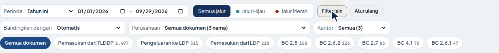
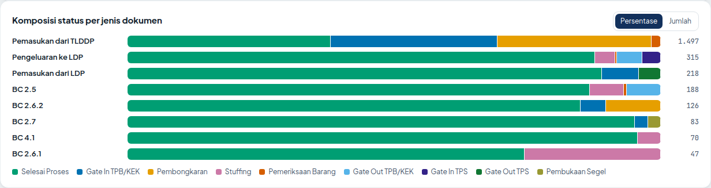
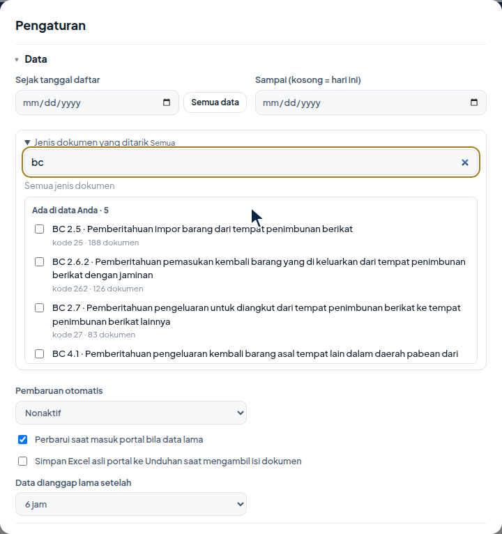

# Panduan Lengkap CEISA Monitor v1.13

Panduan ini menjelaskan setiap fitur secara berurutan, dari pemasangan sampai laporan. Semua gambar memakai data demo.

[Kembali ke README](../README.md) · [Alur kerja](ALUR_KERJA.md) · [Tanya jawab](FAQ.md)

## Daftar isi

1. [Pemasangan dan layar sambutan](#1-pemasangan-dan-layar-sambutan)
2. [Menarik data pertama kali](#2-menarik-data-pertama-kali)
3. [Kepala dasbor](#3-kepala-dasbor)
4. [Periode, pembanding, dan filter](#4-periode-pembanding-dan-filter)
5. [Enam angka utama](#5-enam-angka-utama)
6. [Perubahan, rincian perubahan status, dan isi dokumen](#6-perubahan-rincian-perubahan-status-dan-isi-dokumen)
7. [Komposisi status](#7-komposisi-status)
8. [Status per jenis, umur dokumen, dan rincian status](#8-status-per-jenis-umur-dokumen-dan-rincian-status)
9. [Penjaluran dan tindak lanjut](#9-penjaluran-dan-tindak-lanjut)
10. [Rincian dokumen](#10-rincian-dokumen)
11. [Mencatat tindak lanjut dan riwayatnya](#11-mencatat-tindak-lanjut-dan-riwayatnya)
12. [Penugasan via WhatsApp](#12-penugasan-via-whatsapp)
13. [Mengelola penanggung jawab](#13-mengelola-penanggung-jawab)
14. [Pengaturan dan SLA](#14-pengaturan-dan-sla)
15. [Profil perusahaan](#15-profil-perusahaan)
16. [Ekspor](#16-ekspor)
17. [Popup dan pembaruan otomatis](#17-popup-dan-pembaruan-otomatis)
18. [Bahasa, tema, dan mode demo](#18-bahasa-tema-dan-mode-demo)

## 1. Pemasangan dan layar sambutan

1. Unduh `ceisa-monitor-v1.13.0.zip` dari halaman [Releases](../../../releases/latest), lalu ekstrak.
2. Buka `chrome://extensions` (Edge: `edge://extensions`), aktifkan **Developer mode**, klik **Load unpacked**, dan pilih folder hasil ekstrak.
3. Klik ikon puzzle di bilah alat, lalu sematkan CEISA Monitor.

Setelah dipasang, dasbor terbuka dengan panduan empat langkah. Pilih **Coba mode demo** untuk melihat semua fitur dengan data contoh. Panduan ini dapat dibuka lagi melalui tautan **Lihat panduan** pada halaman "Belum ada data".


Memperbarui versi: ekstrak paket baru ke folder yang sama, lalu klik ikon muat ulang (↻) pada kartu CEISA Monitor di `chrome://extensions`. Data dan catatan tidak hilang.

## 2. Menarik data pertama kali

1. Masuk ke portal CEISA 4.0 seperti biasa dengan akun Anda sendiri.
2. Buka halaman **Daftar Dokumen** (`portal.beacukai.go.id/dokumen-pabean/`) dan tunggu sampai tabel dokumen tampil. Tombol **CEISA Monitor** muncul di pojok kanan bawah portal.
3. Buka dasbor, lalu klik **Perbarui data**. Biarkan tab portal tetap terbuka.
4. Atur **Profil perusahaan** (bagian 15).

Secara bawaan, CEISA Monitor menarik **semua data** yang tersedia di portal, termasuk tahun-tahun sebelumnya. Penarikan pertama memerlukan beberapa menit, tergantung jumlah dokumen. Bila portal membatasi jumlah hasil per permintaan, penarikan otomatis dilanjutkan per kode dokumen. Setelah itu, data diperbarui otomatis setiap kali Anda masuk ke portal dan data sudah lebih lama dari batas yang diatur (bawaan 6 jam).


## 3. Kepala dasbor


- **ID / EN**: mengganti bahasa antarmuka. Dasbor selalu terbuka dalam bahasa Indonesia; English hanya tampil bila dipilih dari tombol ini.
- **Auto / Terang / Gelap**: tema tampilan.
- **Status sesi**: menunjukkan apakah portal terhubung dan berapa lama lagi sesi berlaku.
- **Perbarui data**: menarik data terbaru dari portal.
- **Ekspor**: **Buat laporan** (presentasi, laporan resmi, dan Excel sekaligus) dan **Bagikan ringkasan** (WhatsApp/surel).
- **Profil perusahaan** dan **Pengaturan**: dijelaskan di bagian 14 dan 15.

## 4. Periode, pembanding, dan filter


- **Periode**: 7, 30, atau 90 hari terakhir, bulan ini, bulan lalu, kuartal ini, tahun ini, tahun lalu, 12 bulan terakhir, semua data, atau rentang tanggal khusus. Grafik otomatis menjadi harian (≤ 45 hari), mingguan (≤ 200 hari), atau bulanan.
- **Bandingkan dengan**: 7 hari lalu, 30 hari lalu, periode sebelumnya, atau periode sama tahun lalu.
- **Jalur dan jenis dokumen**: menyaring seluruh dasbor sekaligus. Bilah filter hanya dua baris agar tidak menutupi layar.
- **Filter lain**: membuka pilihan **Bandingkan dengan**, perusahaan, dan kantor. Titik emas di tombol menandakan ada filter lain yang aktif.
- **Atur ulang**: kembali ke tampilan awal.



Bila tanggal awal penarikan pernah diubah dan periode yang dipilih lebih awal dari data yang tersimpan, dasbor menampilkan tombol **Tarik data sejak …** dan **Tarik semua data**.


## Hari ini

Kartu **Hari ini** di bagian atas dasbor menampilkan hal yang perlu ditindaklanjuti sekarang: tugas terlambat atau jatuh tempo, dokumen Jalur Merah atau pemeriksaan yang belum selesai, dokumen yang baru melewati SLA, dan dokumen melewati SLA yang belum memiliki penanggung jawab. Klik satu baris untuk langsung melihat daftarnya. Bila tidak ada yang mendesak, kartu menyatakannya.


## 5. Enam angka utama

Setiap kartu menampilkan nilai, keterangan, selisih terhadap pembanding (hijau berarti membaik, merah berarti memburuk), dan garis kecil pergerakan 30 hari terakhir. Arahkan kursor ke garis untuk melihat nilai per tanggal. Klik kartu **Sesuai SLA**, **Belum selesai**, atau **Lebih dari 30 hari** untuk langsung melihat dokumennya.


## 6. Perubahan, rincian perubahan status, dan isi dokumen


Kartu Perubahan menampilkan dokumen yang berubah status, menjadi selesai, dokumen baru, dan dokumen yang baru melewati SLA. Pembandingnya dapat dipilih: sejak kemarin, sejak Senin, 7 hari terakhir, sejak terakhir Anda membuka dasbor, atau sejak pembaruan sebelumnya. Klik angkanya untuk melihat dokumen di tabel rincian.

Di tabel rincian, arahkan kursor atau klik tanda **BERUBAH** untuk melihat:

- status sebelum dan sesudah;
- kapan status lama terakhir terlihat dan status baru pertama terlihat, serta rentang waktu perubahannya;
- respons dan waktu respons dari portal (misalnya SPPB atau SPJM);
- Riwayat Status dan Riwayat Respon dari portal, dengan jam persis.

**Riwayat dari portal pada ikon BERUBAH.** Saat popup dibuka, CEISA Monitor mengambil riwayat satu dokumen dari alamat yang sama dengan tab Riwayat Status dan Riwayat Respon di portal (dua permintaan baca-saja). Tampil sebagai lini masa: setiap status dengan tanggal dan jam, terbaru di atas, lalu daftar respons (misalnya SPPB, SPPD). Status yang muncul sejak pengecekan terakhir diberi label **baru**, dan baris **Sesudah** menulis "terjadi … (jam portal)". Nama petugas dan nomor identitas tidak diambil.

Syaratnya, tab portal CEISA terbuka dan sudah masuk. Bila tidak, popup menampilkan pesan dan tetap memakai rekaman ekstensi sebagai cadangan. Riwayat disimpan di komputer Anda: dokumen berjalan diambil ulang bila statusnya berubah atau lebih dari 30 menit, dokumen final tidak diambil ulang.

Bila riwayat portal tidak tersedia, waktu dasar yang ditampilkan adalah saat perubahan terlihat pada pembaruan data. Bila rekaman pada tanggal pembanding tidak ada, status sebelumnya diperkirakan dari tanggal daftar dan tanggal respons, dan diberi label **perkiraan**.

**Kartu arsip dan isi dokumen.** Klik dua kali baris di tabel rincian untuk membuka kartu arsip: dokumen pelengkap dengan nama resmi, barang, nilai dan logistik, pungutan, dan jaminan. Isinya dibaca dari layanan Unduh Excel portal. Kotak pencarian rincian ikut mencari nomor invoice, B/L, kontrak, dan kontainer.


**Ambil isi dokumen dengan cakupan.** Untuk banyak dokumen sekaligus, klik **Ambil isi dokumen…** di kartu **Isi dokumen**. Dialog cakupan meminta:

- **Rentang tanggal daftar**: Bulan ini, 90 hari, Tahun ini, atau Sesuai filter dasbor.
- **Jenis dokumen**: hanya jenis yang ada di data pada rentang tanggal terpilih, beserta jumlahnya. Kosong berarti semua jenis. Jenis yang sudah terambil menampilkan jumlah terambil dan pilihan **Ambil ulang**.
- **Ringkasan**: jumlah dokumen yang sesuai, yang dilewati karena isinya sudah diambil, yang akan dibaca, dan perkiraan waktu dalam menit.

Tidak ada batas jumlah per klik. Klik tombol yang sama untuk berhenti, lalu lanjutkan kapan saja; dokumen yang sudah diambil dilewati.


**Nilai dan pungutan.** Kartu Isi dokumen memiliki dua tab. Tab **Nilai dan pungutan** menampilkan kartu ringkasan (dokumen, nilai pabean, pungutan dibayar, pungutan berfasilitas, netto, dan kontainer), total per jenis pungutan, dan tabel **Rincian per dokumen** dengan kolom nilai pabean, BM, PPN, PPh, total dibayar, dan fasilitas. Tabel ini dapat dicari dan diurutkan per kolom. BC 2.5 dan dokumen sejenis dibaca dari lembar PUNGUTAN portal, karena kolom tarif per barang di dokumen itu bernilai 0; dibayar berarti kode fasilitas 1 (dibayar) dan 7 (sudah dilunasi), sedangkan dibebaskan, ditangguhkan, ditanggung pemerintah, dan tidak dipungut dihitung sebagai fasilitas. Tabel **Menurut fasilitas** merinci porsi tiap fasilitas, dan sebuah catatan muncul bila total pungutan portal berbeda dari jumlah tarif per barang. Tab **Rekap bulanan** menampilkan, per bulan tanggal daftar, jumlah dokumen, nilai pabean, pungutan yang dibayar, pungutan yang mendapat fasilitas (ditangguhkan, dibebaskan, tidak dipungut), dan persentase fasilitas. Tombol **Excel** di kartu ini mengunduh lembar Nilai & Pungutan (ringkasan, total per jenis pungutan, rekap bulanan) dan Nilai per Dokumen untuk periode yang tampil. Kolom **Isi** (✓) di tabel rincian dan filter **Isi dokumen** (Sudah/Belum diambil) menunjukkan dokumen yang isinya sudah diambil; tombol **Ambil yang belum** melengkapi sisanya.


**Kode respons angka.** Respons yang tampil sebagai angka (misalnya 2305) langsung diterjemahkan dengan tabel Referensi Respon resmi CEISA 4.0 dari [portal pengembang Bea Cukai](https://openapi.beacukai.go.id/portal/). Artinya bergantung pada jenis dokumen: akhiran 03 berarti SPPB pada BC 2.3, tetapi Surat Perintah Pemeriksaan Fisik pada BC 2.6.1. Sel Respons menampilkan singkatannya; klik untuk melihat nama lengkap. BC 4.0 dan BC 4.1 tidak tercantum di tabel resmi, sehingga kodenya tidak ditebak.

Tanda **SLA** menampilkan tanggal daftar, batas SLA, dan sejak kapan batas itu terlewati.


## 7. Komposisi status


Kartu **Komposisi status** menampilkan donat dan daftar status dengan jumlah dan persentase dokumen pada periode terpilih. Klik satu status untuk menyaring tabel rincian pada status tersebut.

Kartu **Komposisi status per jenis dokumen** menampilkan satu batang per jenis dokumen berisi porsi tiap status (tombol Persentase atau Jumlah). Klik segmen untuk menyaring rincian pada jenis dokumen dan status tersebut.



## 8. Status per jenis, umur dokumen, dan rincian status


Klik baris jenis dokumen untuk menyaring dasbor. Klik sel pada peta umur untuk melihat dokumen dengan status dan umur tersebut.

Grafik **Tingkat penyelesaian** menampilkan persentase dokumen yang sudah selesai menurut tanggal daftar. Tombol **Rincian status** menampilkan setiap status secara lengkap, masing-masing dengan warna berbeda. Tanda ▲ menunjukkan catatan kejadian dari Profil perusahaan.


## 9. Penjaluran dan tindak lanjut


- **Penjaluran dokumen**: jumlah Jalur Hijau dan Jalur Merah, serta Jalur Merah per jenis dokumen.
- **Tindak lanjut**: perlu tindak lanjut, sedang berjalan, melewati target, dan selesai dicek; cakupan tindak lanjut; dan daftar penanggung jawab.
- Tombol **Kirim tugas via WhatsApp** (bagian 12) dan **Salin memo per penanggung jawab** (memo formal).

## 10. Rincian dokumen


- Cari nomor pengajuan, nomor daftar, respons, penanggung jawab, atau catatan.
- Saring menurut status, umur, tindak lanjut (termasuk **Jatuh tempo**), dan perubahan; urutkan menurut umur, SLA, atau target.
- Klik nomor pengajuan untuk menyalinnya.
- Baris bergaris merah di kiri adalah dokumen prioritas: Jalur Merah, status pemeriksaan, atau respons SPJM/SPJK/SPPF.
- Baris bergaris kuning dengan label **VERIFIKASI** adalah dokumen berstatus Pemeriksaan Dokumen dengan jalur bukan merah: dokumen perlu disampaikan dan diverifikasi ke kantor Bea Cukai. Ini berbeda dari Jalur Merah (pemeriksaan fisik).

## 11. Mencatat tindak lanjut dan riwayatnya

Klik **+ Catat** pada baris dokumen, atau centang beberapa dokumen lalu klik **Isi tindak lanjut**.


| Kolom | Isi |
|---|---|
| Penanggung jawab | Nama orang yang menangani; nama yang pernah dipakai muncul sebagai saran |
| Status tindak lanjut | Belum ditindaklanjuti, Sedang dicek, Menunggu pihak lain, Selesai dicek |
| Target selesai | Tanggal target; dipakai untuk kartu Hari ini dan filter Jatuh tempo |
| Nomor WhatsApp | Disimpan per nama, cukup diisi sekali |
| Tugas yang diminta | Terisi otomatis dari templat bawaan sesuai status dokumen. Pilih **Tulis sendiri…** untuk mengosongkan kolom lalu mengetik tugas sendiri; mengetik langsung di kolom juga bisa |
| Catatan | Keterangan bebas |

Bagian bawah dialog menampilkan **Riwayat status dokumen** dan **Riwayat tindak lanjut**. Setiap perubahan penanggung jawab, status, target, tugas, catatan, dan pengiriman WhatsApp tercatat dengan waktunya. Riwayat tidak dapat diubah karena berfungsi sebagai jejak audit.


## 12. Penugasan via WhatsApp

- Di dialog tindak lanjut, klik **Simpan & salin pesan** untuk menyalin pesan tugas, atau **Simpan & buka WhatsApp** untuk langsung membuka WhatsApp ke nomor penanggung jawab.
- Di kartu Tindak lanjut, klik **Kirim tugas via WhatsApp** untuk mengirim satu pesan per penanggung jawab. Pilih nama untuk melihat pratinjau, atur cakupan (semua tugas, melewati target, jatuh tempo, atau belum pernah dikirim), lalu **Salin pesan** atau **Buka WhatsApp**.
- Dokumen yang tugasnya sudah dikirim ditandai **✓ WA** di tabel rincian.


Contoh pesan:

```
*TUGAS TINDAK LANJUT DOKUMEN PABEAN*
Kepada: Budi
Tanggal: 28 September 2026

Mohon ditindaklanjuti dokumen berikut:

1. *201049B8676F82809202601545*
   Jenis: Pemasukan dari TLDDP
   Nomor pendaftaran: 040147 tanggal 28-09-2026
   Status: Pembongkaran · umur 9 hari (SLA 7 hari) · Jalur Hijau
   Tugas: Pastikan realisasi pembongkaran sudah dilakukan dan dicatat, lalu laporkan jumlah barang yang diterima.
   Target: *30-09-2026*

Mohon balas pesan ini dengan perkembangan terbaru dan kabari bila ada kendala. Terima kasih.
```

Ekstensi tidak mengirim pesan sendiri. WhatsApp hanya dibuka saat Anda mengklik tombolnya, dan Anda sendiri yang menekan kirim.


## 13. Mengelola penanggung jawab

| Keperluan | Cara |
|---|---|
| Mengubah isian satu dokumen | Klik isi kolom Tindak lanjut pada dokumen, ubah, lalu Simpan |
| Menghapus penanggung jawab saja | Kosongkan kolom Penanggung jawab, lalu Simpan |
| Menghapus seluruh catatan dokumen | Klik **Hapus** di kiri bawah dialog |
| Mengganti nama untuk banyak dokumen | Cari nama di kotak pencarian, centang kotak judul tabel, klik **Isi tindak lanjut**, isi nama baru, Simpan |
| Menandai selesai | Ubah status tindak lanjut menjadi **Selesai dicek** |
| Mengubah nomor WhatsApp | Di dialog tindak lanjut atau di dialog Kirim tugas via WhatsApp |

Pada pengisian massal, kolom yang dibiarkan kosong tidak mengubah isian lama. Nama di daftar saran hilang dengan sendirinya setelah tidak dipakai di dokumen mana pun.

## 14. Pengaturan dan SLA


Dua bagian yang dapat dilipat:

- **Data**: sejak dan sampai tanggal daftar (kosong = semua data), **jenis dokumen yang ditarik**, pembaruan otomatis, pembaruan saat masuk portal, pilihan menyimpan Excel asli portal ke Unduhan, dan batas data dianggap lama.
- **SLA**: batas hari bawaan, per jenis dokumen, dan per status. Kolom kosong mengikuti batas di atasnya.

**Jenis dokumen yang ditarik** kini berupa pemilih centang dari tabel referensi resmi (243 jenis), bukan kolom ketik kode. Jenis yang ada di data Anda tampil paling atas beserta jumlahnya; ada kolom cari. Kosong berarti semua jenis.



## 15. Profil perusahaan


Isi jenis fasilitas (menentukan templat SLA), nama, target SLA, warna, dan logo. **Status final** dan **Catatan kejadian** ada di bagian yang dapat dilipat. Profil dapat diekspor dan diimpor agar rekan satu perusahaan memakai pengaturan yang sama.

## 16. Ekspor


| Ekspor | Isi |
|---|---|
| Buat laporan | Pilih periode sekali, lalu centang berkas yang dibuat: presentasi 22 slide (judul berupa kesimpulan, slide "Keputusan yang dimohon"), laporan resmi A4 format dinas (cetak ke PDF atau unduh sebagai Word), dan/atau Excel dengan lembar pilihan |
| Bagikan ringkasan | Pratinjau, pilihan bagian, format WhatsApp atau teks biasa |


## 17. Popup dan pembaruan otomatis


Klik ikon CEISA Monitor untuk melihat umur data, status sesi, empat angka utama, dan hasil pembaruan terakhir. Lencana ikon berubah abu-abu bila data sudah lama.

Bila komputer dimatikan atau sesi portal berakhir, data diperbarui otomatis saat Anda masuk kembali ke portal atau saat Chrome dibuka dan portal sudah masuk. Tren tetap lengkap karena dihitung ulang dari tanggal daftar dan tanggal respons setiap dokumen.

## 18. Bahasa, tema, dan mode demo

- Dasbor selalu terbuka dalam bahasa Indonesia sejak pembukaan pertama, tanpa mengikuti bahasa Chrome. Klik **ID** atau **EN** di kepala dasbor untuk mengganti. Pilihan berlaku juga untuk popup. Presentasi, laporan resmi, Excel, dan ringkasan disusun dalam bahasa Indonesia.
- Klik **Auto**, **Terang**, atau **Gelap** untuk tema tampilan.
- Mode demo menampilkan data contoh. Untuk keluar, klik **Mode demo aktif · Keluar**.


---

Masih ada pertanyaan? Lihat [Tanya jawab](FAQ.md) atau buka [Issues](../../../issues/new/choose).
