# Panduan Lengkap CEISA Monitor v1.8

Panduan ini menjelaskan setiap fitur secara berurutan, dari pemasangan sampai laporan. Semua gambar memakai data demo.

[Kembali ke README](../README.md) · [Alur kerja](ALUR_KERJA.md) · [Tanya jawab](FAQ.md)

## Daftar isi

1. [Pemasangan dan layar sambutan](#1-pemasangan-dan-layar-sambutan)
2. [Menarik data pertama kali](#2-menarik-data-pertama-kali)
3. [Kepala dasbor](#3-kepala-dasbor)
4. [Periode, pembanding, dan filter](#4-periode-pembanding-dan-filter)
5. [Enam angka utama](#5-enam-angka-utama)
6. [Perubahan dan rincian perubahan status](#6-perubahan-dan-rincian-perubahan-status)
7. [Aliran dokumen](#7-aliran-dokumen)
8. [Status per jenis, umur dokumen, dan rincian status](#8-status-per-jenis-umur-dokumen-dan-rincian-status)
9. [Penjaluran dan tindak lanjut](#9-penjaluran-dan-tindak-lanjut)
10. [Rincian dokumen](#10-rincian-dokumen)
11. [Mencatat tindak lanjut dan riwayatnya](#11-mencatat-tindak-lanjut-dan-riwayatnya)
12. [Penugasan via WhatsApp](#12-penugasan-via-whatsapp)
13. [Ringkasan pagi, pengingat, dan prioritas](#13-ringkasan-pagi-pengingat-dan-prioritas)
14. [Mengelola penanggung jawab](#14-mengelola-penanggung-jawab)
15. [Templat tugas dan berbagi data tim](#15-templat-tugas-dan-berbagi-data-tim)
16. [Pengaturan dan SLA](#16-pengaturan-dan-sla)
17. [Profil perusahaan](#17-profil-perusahaan)
18. [Ekspor](#18-ekspor)
19. [Popup dan pembaruan otomatis](#19-popup-dan-pembaruan-otomatis)
20. [Bahasa, tema, dan mode demo](#20-bahasa-tema-dan-mode-demo)

## 1. Pemasangan dan layar sambutan

1. Unduh `ceisa-monitor-v1.9.0.zip` dari halaman [Releases](../../../releases/latest), lalu ekstrak.
2. Buka `chrome://extensions` (Edge: `edge://extensions`), aktifkan **Developer mode**, klik **Load unpacked**, dan pilih folder hasil ekstrak.
3. Klik ikon puzzle di bilah alat, lalu sematkan CEISA Monitor.

Setelah dipasang, dasbor terbuka dengan panduan empat langkah. Pilih **Coba mode demo** untuk melihat semua fitur dengan data contoh. Panduan ini dapat dibuka lagi melalui tautan **Lihat panduan** pada halaman "Belum ada data".

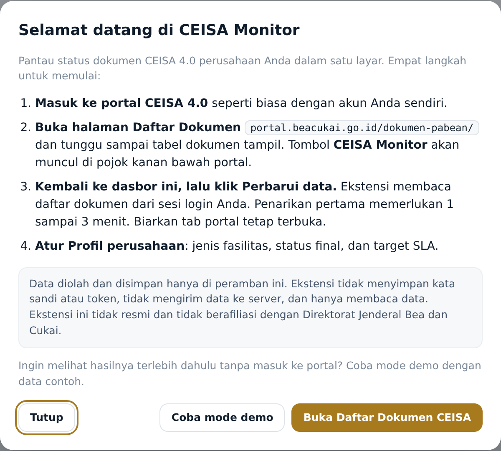

Memperbarui versi: ekstrak paket baru ke folder yang sama, lalu klik ikon muat ulang (↻) pada kartu CEISA Monitor di `chrome://extensions`. Data dan catatan tidak hilang.

## 2. Menarik data pertama kali

1. Masuk ke portal CEISA 4.0 seperti biasa dengan akun Anda sendiri.
2. Buka halaman **Daftar Dokumen** (`portal.beacukai.go.id/dokumen-pabean/`) dan tunggu sampai tabel dokumen tampil. Tombol **CEISA Monitor** muncul di pojok kanan bawah portal.
3. Buka dasbor, lalu klik **Perbarui data**. Biarkan tab portal tetap terbuka.
4. Atur **Profil perusahaan** (bagian 17).

Secara bawaan, CEISA Monitor menarik **semua data** yang tersedia di portal, termasuk tahun-tahun sebelumnya. Penarikan pertama memerlukan beberapa menit, tergantung jumlah dokumen. Bila portal membatasi jumlah hasil per permintaan, penarikan otomatis dilanjutkan per kode dokumen. Setelah itu, data diperbarui otomatis setiap kali Anda masuk ke portal dan data sudah lebih lama dari batas yang diatur (bawaan 6 jam).

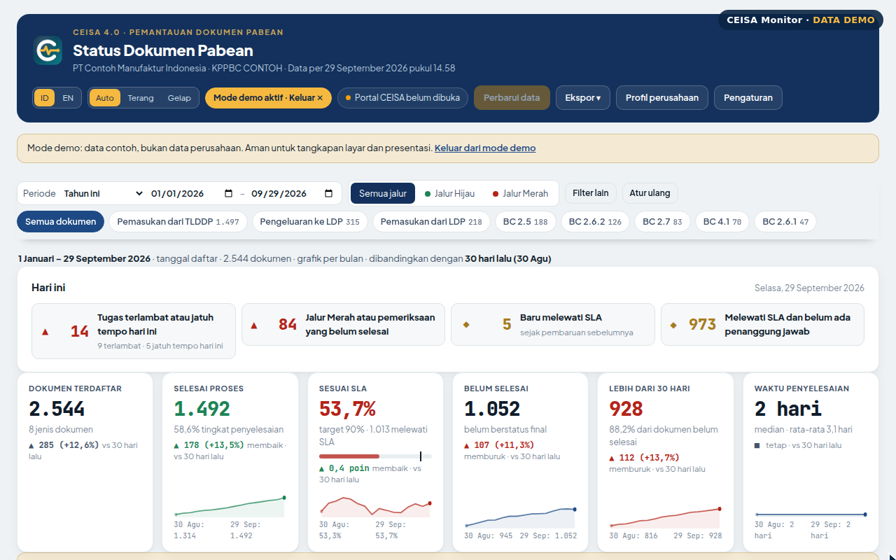

## 3. Kepala dasbor

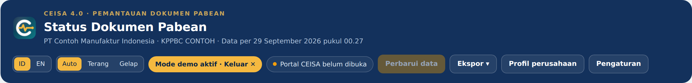

- **ID / EN**: mengganti bahasa antarmuka.
- **Auto / Terang / Gelap**: tema tampilan.
- **Status sesi**: menunjukkan apakah portal terhubung dan berapa lama lagi sesi berlaku.
- **Perbarui data**: menarik data terbaru dari portal.
- **Ekspor**: presentasi, laporan resmi, Excel, CSV, ringkasan WhatsApp, dan cetak.
- **Profil perusahaan** dan **Pengaturan**: dijelaskan di bagian 16 dan 17.

## 4. Periode, pembanding, dan filter

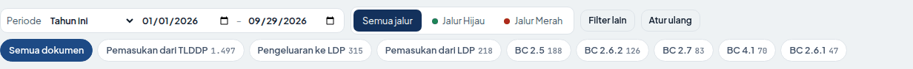

- **Periode**: 7, 30, atau 90 hari terakhir, bulan ini, bulan lalu, kuartal ini, tahun ini, tahun lalu, 12 bulan terakhir, semua data, atau rentang tanggal khusus. Grafik otomatis menjadi harian (≤ 45 hari), mingguan (≤ 200 hari), atau bulanan.
- **Bandingkan dengan**: 7 hari lalu, 30 hari lalu, periode sebelumnya, atau periode sama tahun lalu.
- **Jalur, perusahaan, kantor, dan jenis dokumen**: menyaring seluruh dasbor sekaligus.
- **Atur ulang**: kembali ke tampilan awal.

Bila tanggal awal penarikan pernah diubah dan periode yang dipilih lebih awal dari data yang tersimpan, dasbor menampilkan tombol **Tarik data sejak …** dan **Tarik semua data**.

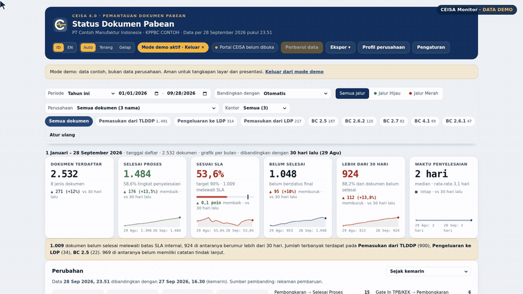

## 5. Enam angka utama

Setiap kartu menampilkan nilai, keterangan, selisih terhadap pembanding (hijau berarti membaik, merah berarti memburuk), dan garis kecil pergerakan 30 hari terakhir. Arahkan kursor ke garis untuk melihat nilai per tanggal. Klik kartu **Sesuai SLA**, **Belum selesai**, atau **Lebih dari 30 hari** untuk langsung melihat dokumennya.


## 6. Perubahan dan rincian perubahan status


Kartu Perubahan menampilkan dokumen yang berubah status, menjadi selesai, dokumen baru, dan dokumen yang baru melewati SLA. Pembandingnya dapat dipilih: sejak kemarin, sejak Senin, 7 hari terakhir, sejak terakhir Anda membuka dasbor, atau sejak pembaruan sebelumnya. Klik angkanya untuk melihat dokumen di tabel rincian.

Di tabel rincian, arahkan kursor atau klik tanda **BERUBAH** untuk melihat:

- status sebelum dan sesudah;
- kapan status lama terakhir terlihat dan status baru pertama terlihat, serta rentang waktu perubahannya;
- respons dan waktu respons dari portal (misalnya SPPB atau SPJM);
- riwayat status dokumen.

Waktu dasar yang ditampilkan adalah saat perubahan terlihat pada pembaruan data. Bila rekaman pada tanggal pembanding tidak ada, status sebelumnya diperkirakan dari tanggal daftar dan tanggal respons, dan diberi label **perkiraan**.

**Kartu arsip dan isi dokumen.** Klik dua kali baris di tabel rincian untuk membuka kartu arsip: dokumen pelengkap dengan nama resmi, barang, nilai dan logistik, pungutan, jaminan, dan pengeluaran sementara terkait. Isinya dibaca dari layanan Unduh Excel portal. Untuk banyak dokumen, klik **Ambil isi dokumen periode ini** di kartu **Isi dokumen**, yang juga menampilkan Pengeluaran sementara (barang yang belum kembali), Nilai dan pungutan, serta Pemeriksaan otomatis. Kotak pencarian rincian ikut mencari nomor invoice, B/L, kontrak, dan kontainer.

**Kode respons angka.** Respons yang tampil sebagai angka (misalnya 2305) langsung diterjemahkan dengan tabel Referensi Respon resmi CEISA 4.0 dari [portal pengembang Bea Cukai](https://openapi.beacukai.go.id/portal/). Artinya bergantung pada jenis dokumen: akhiran 03 berarti SPPB pada BC 2.3, tetapi Surat Perintah Pemeriksaan Fisik pada BC 2.6.1. Sel Respons menampilkan singkatannya; klik untuk melihat nama lengkap. BC 4.0 dan BC 4.1 tidak tercantum di tabel resmi, sehingga kodenya tidak ditebak.

**Riwayat dari portal (jam pasti).** Klik **Ambil riwayat dari portal** di kartu ini, di kolom Respons yang bertuliskan "tanpa nama" atau berupa angka, atau di dialog tindak lanjut. CEISA Monitor mengambil Riwayat Status (termasuk Validasi, Siap Jalur, dan Penjaluran) dan Riwayat Respon langsung dari portal, sehingga Anda tidak perlu lagi mencari nomor pendaftaran, membuka dokumen, dan tab Riwayat Respon satu per satu. Fitur ini langsung aktif tanpa pengaturan. Untuk laporan, pilih beberapa dokumen lalu klik **Ambil riwayat portal**, atau klik **Lengkapi riwayat dari portal** di dialog Excel; lembar **Riwayat Portal** berisi waktu layanan dan lama setiap perpindahan status, dan **Riwayat Rinci** berisi setiap status dan respons dengan jamnya. Nama petugas dan pengguna tidak diambil. Tanda **SLA** menampilkan tanggal daftar, batas SLA, dan sejak kapan batas itu terlewati.

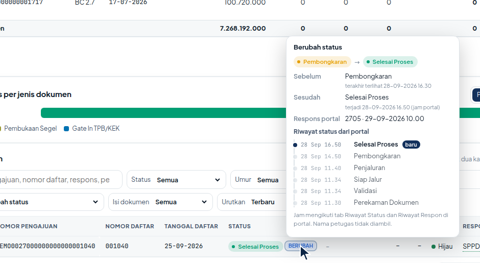

## 7. Aliran dokumen

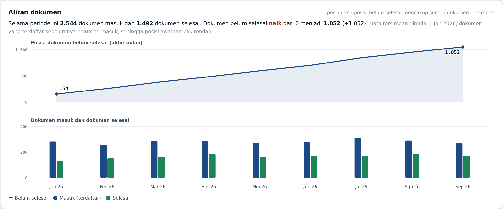

- **Panel atas**: jumlah dokumen belum selesai di akhir setiap hari, minggu, atau bulan.
- **Panel bawah**: dokumen masuk (biru) dibandingkan dengan dokumen selesai (hijau). Bila batang hijau lebih tinggi, tumpukan berkurang.
- Kalimat di atas grafik merangkum kesimpulannya.


## 8. Status per jenis, umur dokumen, dan rincian status

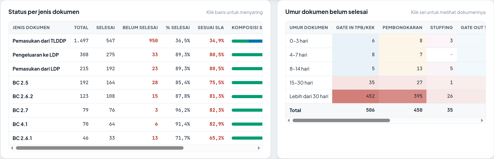

Klik baris jenis dokumen untuk menyaring dasbor. Klik sel pada peta umur untuk melihat dokumen dengan status dan umur tersebut.

Grafik **Tingkat penyelesaian** menampilkan persentase dokumen yang sudah selesai menurut tanggal daftar. Tombol **Rincian status** menampilkan setiap status secara lengkap, masing-masing dengan warna berbeda. Tanda ▲ menunjukkan catatan kejadian dari Profil perusahaan.

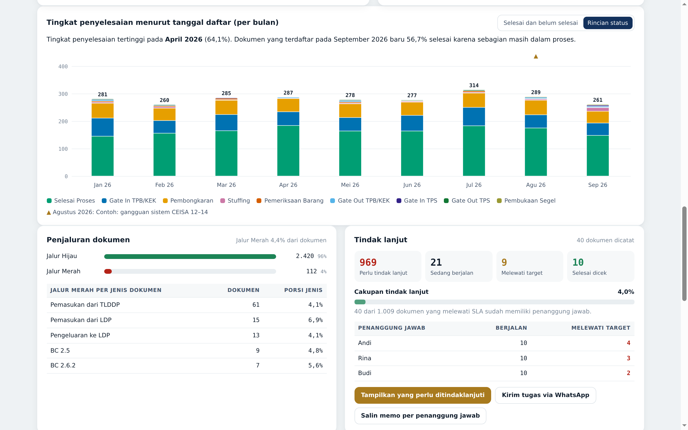

## 9. Penjaluran dan tindak lanjut

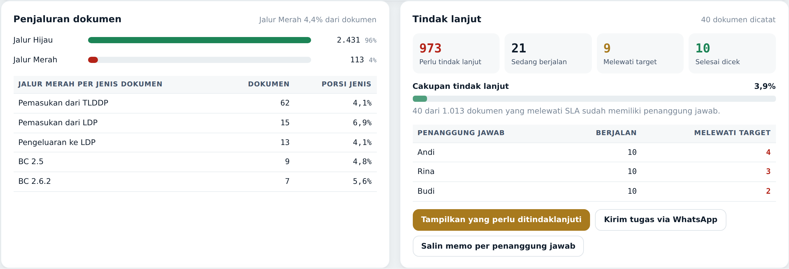

- **Penjaluran dokumen**: jumlah Jalur Hijau dan Jalur Merah, serta Jalur Merah per jenis dokumen.
- **Tindak lanjut**: perlu tindak lanjut, sedang berjalan, melewati target, dan selesai dicek; cakupan tindak lanjut; dan daftar penanggung jawab.
- Tombol **Kirim tugas via WhatsApp** (bagian 12) dan **Salin memo per penanggung jawab** (memo formal).

## 10. Rincian dokumen

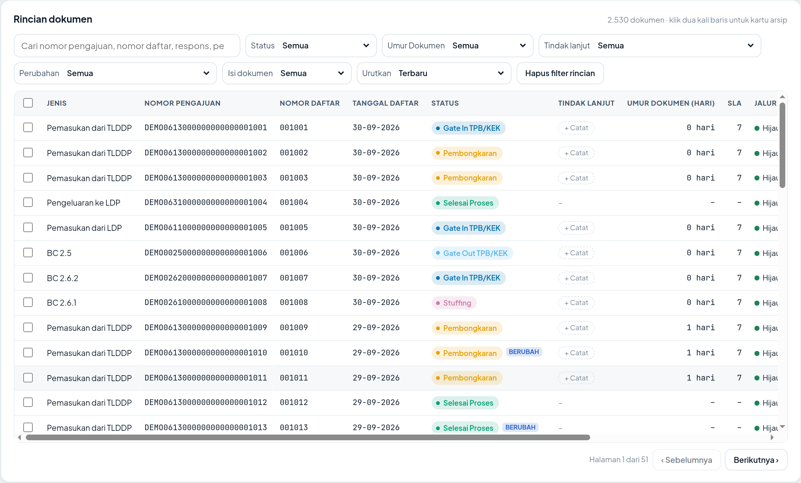

- Cari nomor pengajuan, nomor daftar, respons, penanggung jawab, atau catatan.
- Saring menurut status, umur, tindak lanjut (termasuk **Jatuh tempo**), dan perubahan (termasuk **Prioritas**); urutkan menurut umur, SLA, atau target.
- Klik nomor pengajuan untuk menyalinnya.
- Baris bergaris merah di kiri adalah dokumen prioritas: Jalur Merah, status pemeriksaan, atau respons SPJM/SPJK/SPPF.

## 11. Mencatat tindak lanjut dan riwayatnya

Klik **+ Catat** pada baris dokumen, atau centang beberapa dokumen lalu klik **Isi tindak lanjut**.

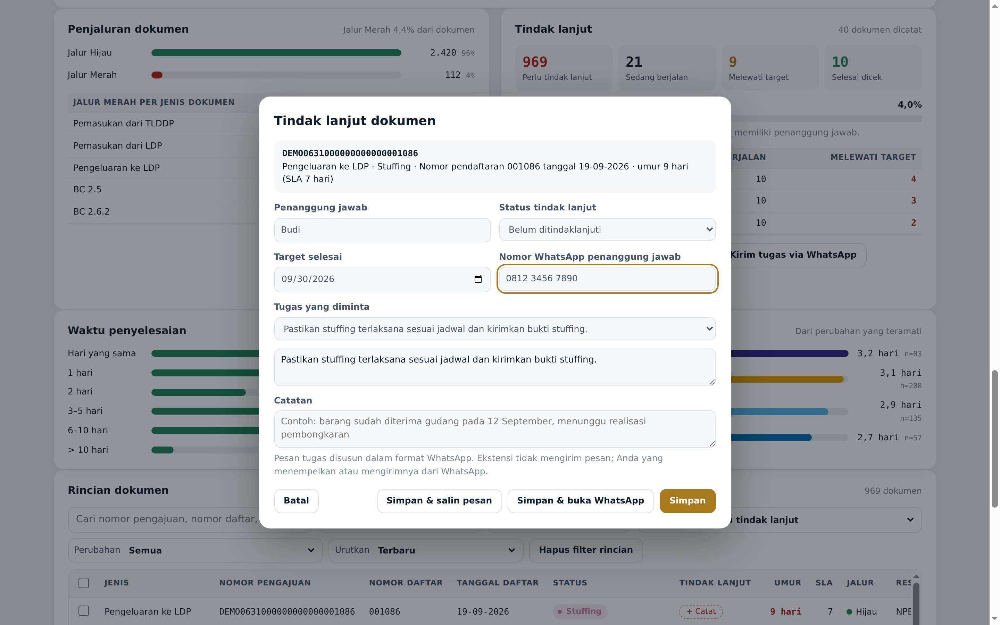

| Kolom | Isi |
|---|---|
| Penanggung jawab | Nama orang yang menangani; nama yang pernah dipakai muncul sebagai saran |
| Status tindak lanjut | Belum ditindaklanjuti, Sedang dicek, Menunggu pihak lain, Selesai dicek |
| Target selesai | Tanggal target; dipakai untuk pengingat dan filter Jatuh tempo |
| Nomor WhatsApp | Disimpan per nama, cukup diisi sekali |
| Tugas yang diminta | Terisi otomatis sesuai status dokumen; dapat diubah |
| Catatan | Keterangan bebas |

Bagian bawah dialog menampilkan **Riwayat status dokumen** dan **Riwayat tindak lanjut**. Setiap perubahan penanggung jawab, status, target, tugas, catatan, dan pengiriman WhatsApp tercatat dengan waktunya. Riwayat tidak dapat diubah karena berfungsi sebagai jejak audit.


## 12. Penugasan via WhatsApp

- Di dialog tindak lanjut, klik **Simpan & salin pesan** untuk menyalin pesan tugas, atau **Simpan & buka WhatsApp** untuk langsung membuka WhatsApp ke nomor penanggung jawab.
- Di kartu Tindak lanjut, klik **Kirim tugas via WhatsApp** untuk mengirim satu pesan per penanggung jawab. Pilih nama untuk melihat pratinjau, atur cakupan (semua tugas, melewati target, jatuh tempo, atau belum pernah dikirim), lalu **Salin pesan** atau **Buka WhatsApp**.
- Dokumen yang tugasnya sudah dikirim ditandai **✓ WA** di tabel rincian.

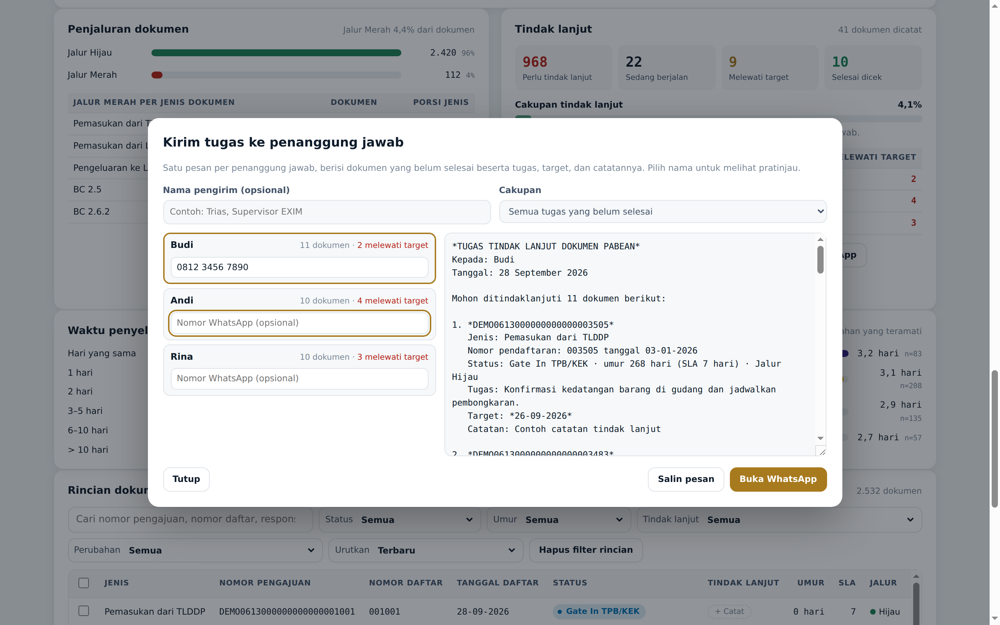

Contoh pesan:

```
*TUGAS TINDAK LANJUT DOKUMEN PABEAN*
Kepada: Budi
Tanggal: 28 September 2026

Mohon ditindaklanjuti dokumen berikut:

1. *201049B8676F82809202601545*
   Jenis: Pemasukan dari TLDDP
   Nomor pendaftaran: 040147 tanggal 28-09-2026
   Status: Pembongkaran · umur 9 hari (SLA 7 hari) · Jalur Hijau
   Tugas: Pastikan realisasi pembongkaran sudah dilakukan dan dicatat, lalu laporkan jumlah barang yang diterima.
   Target: *30-09-2026*

Mohon balas pesan ini dengan perkembangan terbaru dan kabari bila ada kendala. Terima kasih.
```

Ekstensi tidak mengirim pesan sendiri. WhatsApp hanya dibuka saat Anda mengklik tombolnya, dan Anda sendiri yang menekan kirim.


## 13. Ringkasan pagi, pengingat, dan prioritas

- **Ringkasan pagi**: setiap hari pada jam yang diatur (bawaan 08.00), notifikasi menampilkan dokumen selesai, baru melewati SLA, prioritas baru, dan tugas jatuh tempo. Tombol **Salin ringkasan WhatsApp** membuka ringkasan siap tempel ke grup tim; tombol **Kirim tugas jatuh tempo** membuka dialog penugasan. Bila komputer mati pada jam tersebut, notifikasi muncul saat Chrome dibuka kembali pada hari itu.
- **Pengingat tugas**: tugas terlambat, jatuh tempo hari ini, dan besok. Saring di tabel rincian dengan **Tindak lanjut → Jatuh tempo**.
- **Peringatan prioritas**: notifikasi saat dokumen baru terkena Jalur Merah, status pemeriksaan, atau respons SPJM/SPJK/SPPF. Saring dengan **Perubahan → Prioritas**.

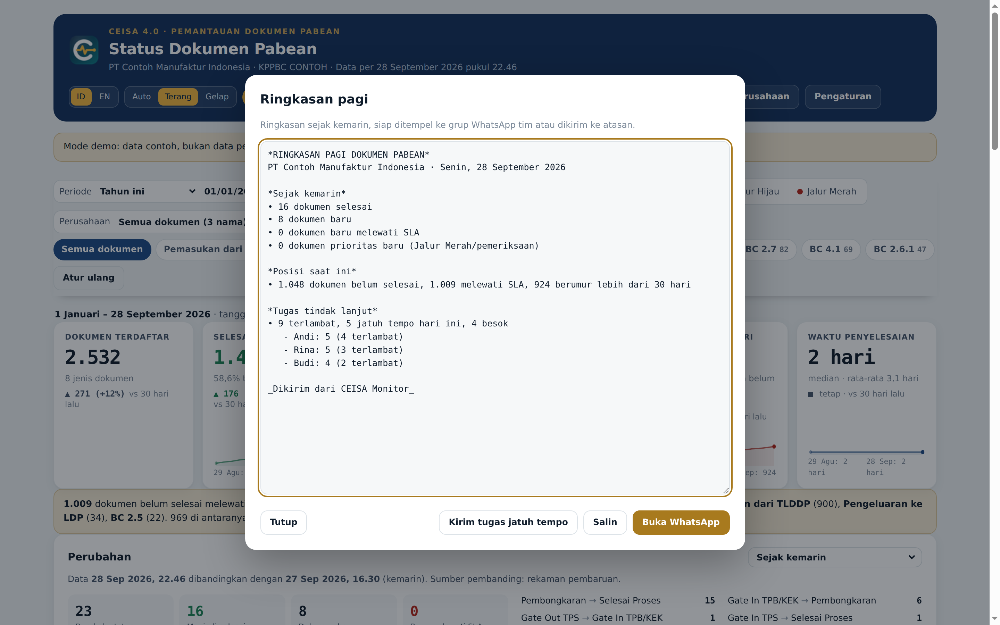

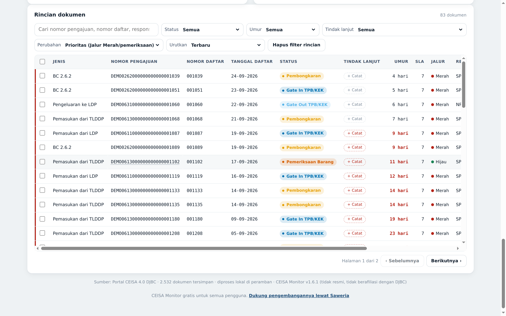

Semua notifikasi dapat dinyalakan atau dimatikan di **Pengaturan → Tindak lanjut dan pengingat**, termasuk jam ringkasan pagi dan tombol untuk mencobanya.

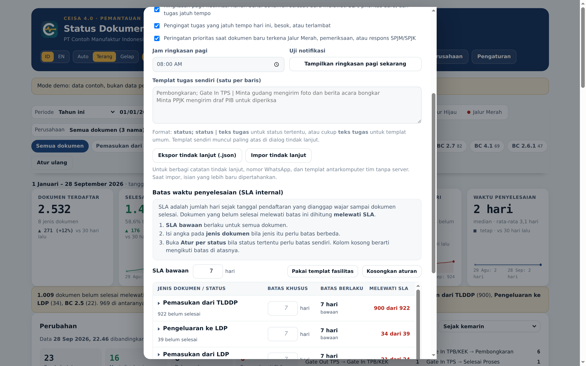

## 14. Mengelola penanggung jawab

| Keperluan | Cara |
|---|---|
| Mengubah isian satu dokumen | Klik isi kolom Tindak lanjut pada dokumen, ubah, lalu Simpan |
| Menghapus penanggung jawab saja | Kosongkan kolom Penanggung jawab, lalu Simpan |
| Menghapus seluruh catatan dokumen | Klik **Hapus** di kiri bawah dialog |
| Mengganti nama untuk banyak dokumen | Cari nama di kotak pencarian, centang kotak judul tabel, klik **Isi tindak lanjut**, isi nama baru, Simpan |
| Menandai selesai | Ubah status tindak lanjut menjadi **Selesai dicek** |
| Mengubah nomor WhatsApp | Di dialog tindak lanjut atau di dialog Kirim tugas via WhatsApp |

Pada pengisian massal, kolom yang dibiarkan kosong tidak mengubah isian lama. Nama di daftar saran hilang dengan sendirinya setelah tidak dipakai di dokumen mana pun.

## 15. Templat tugas dan berbagi data tim

**Templat tugas sendiri** diisi di Pengaturan, satu per baris:

```
Pembongkaran; Gate In TPS | Minta gudang mengirim foto dan berita acara bongkar
Minta PPJK mengirim draf PIB untuk diperiksa
```

Nama status di depan tanda `|` membuat templat disarankan untuk status tersebut; tanpa tanda `|`, templat berlaku umum. Templat sendiri muncul paling atas di dialog tindak lanjut.

**Ekspor dan impor tindak lanjut (.json)** di Pengaturan memindahkan catatan tindak lanjut, nomor WhatsApp, dan templat ke komputer rekan satu tim tanpa server. Saat impor, isian yang lebih baru dipertahankan dan riwayatnya digabung.

## 16. Pengaturan dan SLA

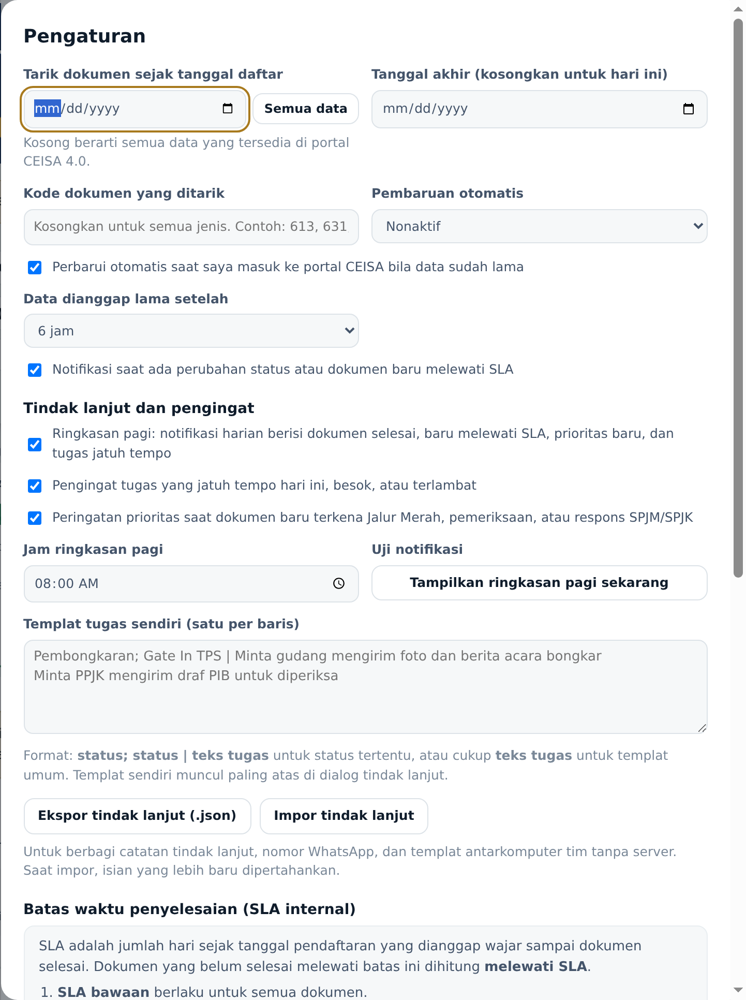

- **Tarik dokumen sejak tanggal daftar**: kosongkan (atau klik **Semua data**) untuk menarik semua dokumen di portal.
- **Kode dokumen yang ditarik**: kosongkan untuk semua jenis.
- **Pembaruan otomatis**: saat masuk ke portal bila data sudah lama, dan opsional terjadwal setiap 30 menit, 1 jam, atau 3 jam selama portal terbuka.
- **Tindak lanjut dan pengingat**: bagian 13 dan 15.
- **SLA**: batas hari bawaan, batas khusus per jenis dokumen, dan per status. Jumlah dokumen yang melewati SLA dihitung ulang saat angka diubah.

## 17. Profil perusahaan

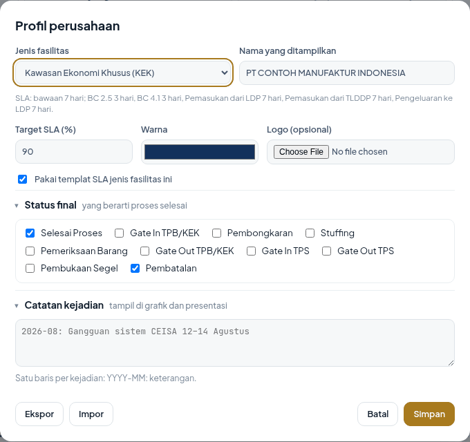

Pilih jenis fasilitas (KEK, kawasan berikat, importir/eksportir umum, PPJK, atau lainnya), nama tampilan, logo, warna, target SLA, status final, dan catatan kejadian. Profil dapat diekspor dan diimpor agar rekan satu perusahaan memakai pengaturan yang sama.

## 18. Ekspor

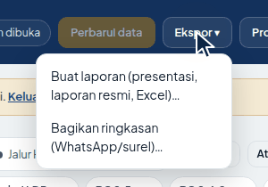

| Ekspor | Isi |
|---|---|
| Paket bulanan | Presentasi, Excel, dan laporan resmi sekaligus |
| Presentasi (.pptx) | 22 slide dengan judul berupa kesimpulan dan slide "Keputusan yang dimohon" |
| Laporan resmi | Format dinas A4 dengan kop, nomor, perihal, dan lembar pengesahan; cetak ke PDF atau unduh sebagai Word |
| Excel (.xlsx) | 8 lembar berformat, preset untuk atasan atau tim, opsi satu lembar per penanggung jawab; tugas ikut di kolom catatan |
| CSV rincian | Data mentah sesuai filter rincian |
| Ringkasan WhatsApp/surel | Pratinjau, pilihan bagian, format WhatsApp atau teks biasa |

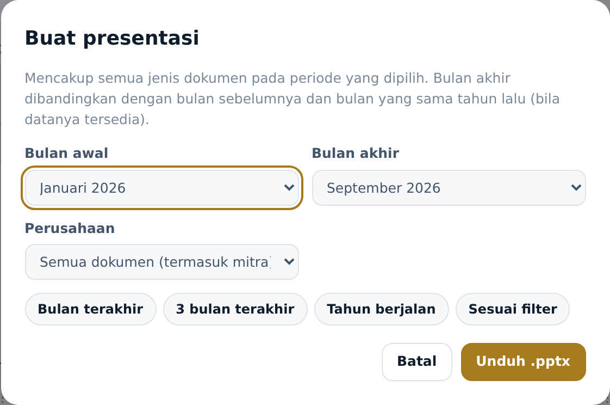

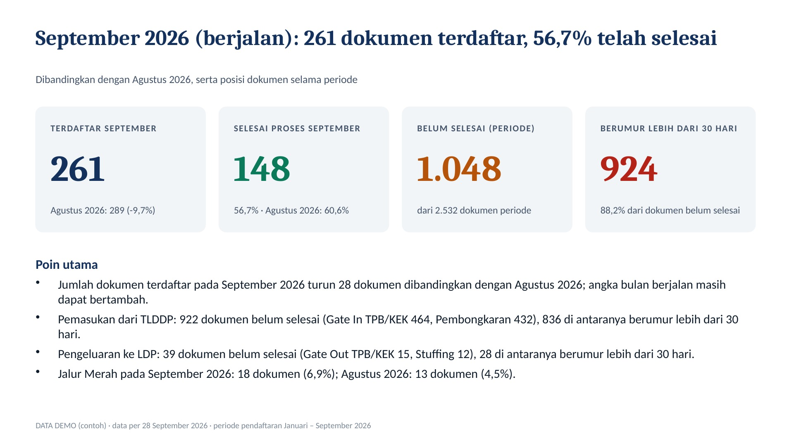

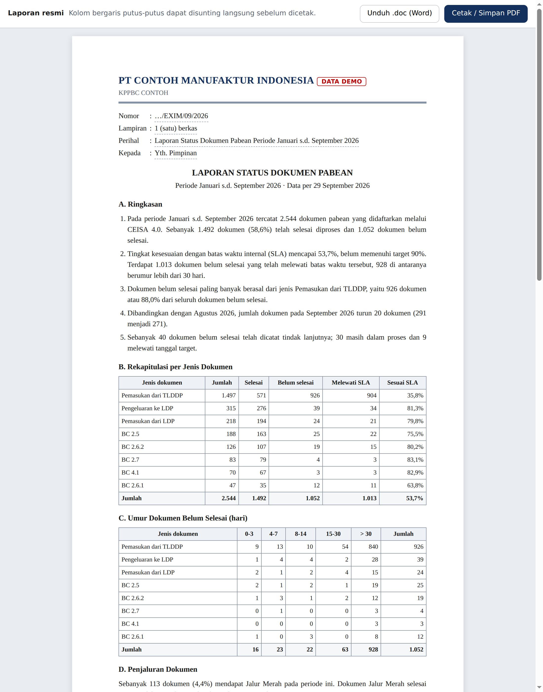

## 19. Popup dan pembaruan otomatis

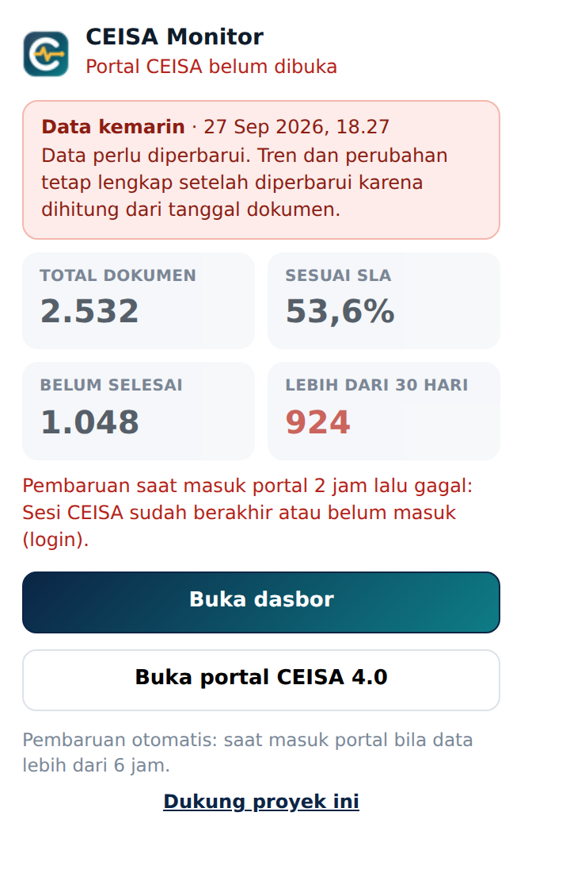

Klik ikon CEISA Monitor untuk melihat umur data, status sesi, empat angka utama, dan hasil pembaruan terakhir. Lencana ikon berubah abu-abu bila data sudah lama.

Bila komputer dimatikan atau sesi portal berakhir, data diperbarui otomatis saat Anda masuk kembali ke portal atau saat Chrome dibuka dan portal sudah masuk. Tren tetap lengkap karena dihitung ulang dari tanggal daftar dan tanggal respons setiap dokumen.

## 20. Bahasa, tema, dan mode demo

- Klik **ID** atau **EN** di kepala dasbor. Pilihan berlaku juga untuk popup dan notifikasi. Presentasi, laporan resmi, Excel, dan ringkasan disusun dalam bahasa Indonesia.
- Klik **Auto**, **Terang**, atau **Gelap** untuk tema tampilan.
- Mode demo menampilkan data contoh. Untuk keluar, klik **Mode demo aktif · Keluar**.

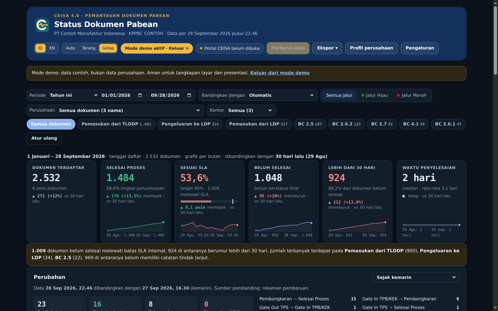

---

Masih ada pertanyaan? Lihat [Tanya jawab](FAQ.md) atau buka [Issues](../../../issues/new/choose).
